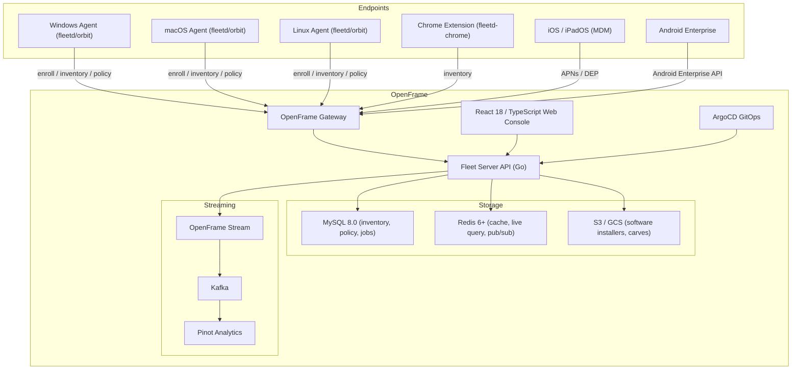

<div align="center">
  <picture>
    <source media="(prefers-color-scheme: dark)" srcset="https://shdrojejslhgnojzkzak.supabase.co/storage/v1/object/public/public/doc-orchestrator/logos/1771371901777-lc3cse-logo-openframe-full-dark-bg.png">
    <source media="(prefers-color-scheme: light)" srcset="https://shdrojejslhgnojzkzak.supabase.co/storage/v1/object/public/public/doc-orchestrator/logos/1771372526604-k3y1w-logo-openframe-full-light-bg.png">
    
  </picture>
</div>

<p align="center">
  <a href="LICENSE.md"></a>
</p>

# FleetMDM

**FleetMDM** is Flamingo's integration of the open-source [Fleet](https://fleetdm.com) device management platform into the [OpenFrame](https://openframe.ai) unified MSP ecosystem. It provides cross-platform device management for Windows, macOS, Linux, ChromeOS, iOS/iPadOS, and Android — powered by osquery agents, MDM protocols, and AI-driven automation from Flamingo.

This repository (`flamingo-stack/fleetmdm`) is the Flamingo fork of Fleet, extending it with OpenFrame multitenancy, streaming analytics (Kafka → Pinot), and Flamingo AI capabilities.

---

## Features

- **Cross-platform MDM** — Manage macOS, iOS/iPadOS, Windows, Linux, Android, and ChromeOS from a single console
- **osquery-powered inventory** — Real-time SQL queries against device hardware, software, users, and processes
- **Policy automation** — Define compliance policies; automatically install software or run scripts on failure
- **Vulnerability management** — Continuous CVE scanning via NVD, OVAL, MSRC, and OSV with CVSS scoring and exploit probability
- **Software management** — Install, update, and uninstall packages at scale; Fleet-maintained app catalog (Homebrew, WinGet)
- **GitOps support** — Manage all Fleet configuration as code with `fleetctl gitops`
- **Self-service portal** — End users can install approved software without opening IT tickets
- **OpenFrame streaming** — Publish inventory and compliance events to Kafka → Cassandra → Pinot Analytics
- **SCIM provisioning** — Sync users and groups from your IdP automatically
- **OpenTelemetry observability** — Distributed tracing, metrics, and logs via SigNoz/OTLP

---

## Architecture



---

## Technology Stack

| Layer | Technology |
|---|---|
| Backend server | Go 1.22+, Cobra, go-kit, sqlx, NanoMDM |
| Frontend | React 18, TypeScript 6, Webpack 5, react-query |
| Primary database | MySQL 8.0 |
| Caching / pub-sub | Redis 6+ |
| File storage | S3 / GCS |
| Streaming analytics | Kafka, Apache Pinot |
| Observability | OpenTelemetry, SigNoz |
| GitOps | ArgoCD, `fleetctl gitops` |
| Container orchestration | Docker Compose (dev), Kubernetes (prod) |

---

## Quick Start

### Prerequisites

- [Go](https://go.dev/dl/) 1.22+
- [Node.js](https://nodejs.org/) 18 LTS and npm 9+
- [Docker](https://docs.docker.com/get-docker/) 20.10+ and Docker Compose v2

### 5-Minute Setup

```bash
# 1. Clone the repository
git clone https://github.com/flamingo-stack/fleetmdm.git
cd fleetmdm

# 2. Start MySQL and Redis
docker compose up -d mysql redis

# 3. Install frontend dependencies
npm install

# 4. Build the web console
npm run build

# 5. Run database migrations
go run ./cmd/fleet/... prepare db \
  --mysql_address=localhost:3306 \
  --mysql_database=fleet \
  --mysql_username=fleet \
  --mysql_password=insecure

# 6. Start the Fleet server
go run ./cmd/fleet/... serve \
  --dev \
  --dev_license \
  --mysql_address=localhost:3306 \
  --mysql_database=fleet \
  --mysql_username=fleet \
  --mysql_password=insecure \
  --redis_address=localhost:6379 \
  --server_tls=false \
  --logging_debug
```

Open [http://localhost:8080](http://localhost:8080) and complete the setup wizard to create your admin account.

> **Apple Silicon:** Set `FLEET_MYSQL_IMAGE=arm64v8/mysql:oracle` and `FLEET_MYSQL_PLATFORM=linux/arm64/v8` before starting Docker Compose.

---

## Core Components

| Component | Location | Language | Responsibility |
|---|---|---|---|
| Fleet Server | `cmd/fleet/` | Go | Main API server, cron scheduling, MDM orchestration |
| Web Console | `frontend/` | React 18 / TypeScript | Operator UI for managing devices, policies, and software |
| `fleetd` / orbit agent | `orbit/` | Go | Device-side agent: enrollment, config polling, script execution |
| MySQL Datastore | `server/datastore/mysql/` | Go | Primary persistence for inventory, policies, software |
| Redis Layer | `server/datastore/redis/` | Go | Caching, live query pub/sub, host status tracking |
| Apple MDM Stack | `server/mdm/apple/` | Go | APNs push, nanoMDM, DEP, SCEP, VPP |
| Microsoft MDM | `server/mdm/microsoft/` | Go | Windows MDM protocol, Entra/Azure integration |
| Android MDM | `server/mdm/android/` | Go | Android Enterprise service |
| Vulnerability Engine | `server/vulnerabilities/` | Go | NVD/CVE/MSRC/OSV/OVAL scanning |
| OpenFrame Integration | `server/service/openframe/` | Go | Multitenancy auth manager, token rotation |
| `fleetctl` CLI | `cmd/fleetctl/` | Go | GitOps apply, query runner, package builder |
| Chrome Extension | `ee/fleetd-chrome/` | TypeScript | Browser-based osquery agent for ChromeOS |

---

## CLI Reference

```bash
# Start the server
fleet serve --dev --dev_license

# Run database migrations
fleet prepare db

# Apply GitOps configuration
fleetctl gitops --config fleet.yml --fleet-url http://localhost:8080

# Run a live query across hosts
fleetctl query --hosts hostname --query "SELECT * FROM os_version"

# Build an enrollment package
fleetctl package --type=pkg --fleet-url=http://localhost:8080 --enroll-secret=<secret>
```

---

## Documentation

📚 See the [Documentation](./docs/README.md) for comprehensive guides including getting started tutorials, development setup, architecture deep-dives, security guidelines, and testing instructions.

---

## Community & Support

- **Community Slack:** [openmsp.ai](https://www.openmsp.ai/) — join `#fleetmdm`
- **Flamingo Platform:** [flamingo.run](https://flamingo.run)
- **OpenFrame:** [openframe.ai](https://openframe.ai)
- **Security issues:** security@flamingo.run
- **Fleet official docs:** [fleetdm.com/docs](https://fleetdm.com/docs)
- **osquery tables reference:** [osquery.io/schema](https://osquery.io/schema)

---

<div align="center">
  Built with 💛 by the <a href="https://www.flamingo.run/about"><b>Flamingo</b></a> team
</div>
