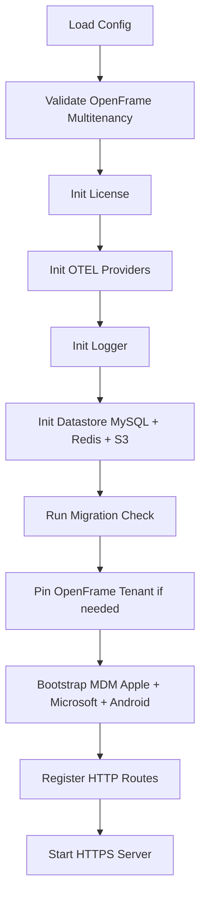

<!-- source-hash: 3c72278645373244a6614a125cd9736c -->
Fleet MDM server entry point that bootstraps and runs the main HTTPS server process, wiring together all subsystems including datastores, MDM providers, licensing, observability, and HTTP routing.

## Key Components

- **`createServeCmd`** — Builds the `cobra.Command` for `fleet serve`, registering CLI flags (`--debug`, `--dev`, `--dev_license`, `--dev_expired_license`)
- **`runServeCmd`** — Core bootstrap function that sequentially initializes every server subsystem
- **`initializer` interface** — Contract for datastores that require pre-population via `Initialize()`
- **`liveQueryMemCacheDuration`** — Constant (`1s`) controlling live-query in-memory cache TTL

## Initialization Sequence



## Usage Example

```bash
# Standard production start
fleet serve --config /etc/fleet/fleet.yml

# Development mode with a premium license
fleet serve --dev --dev_license --debug

# Allow booting with missing DB migrations (non-prod only)
fleet serve --upgrades.allow_missing_migrations
```

## Key Subsystems Wired

| Subsystem | Package |
|-----------|---------|
| Datastore | `mysql`, `mysqlredis`, `redis`, `s3` |
| MDM | `apple_mdm`, `microsoft_mdm`, `android_service` |
| Licensing | `ee/server/licensing` |
| Observability | `platform/tracing` (OTEL traces, metrics, logs) |
| Auth | `authz`, `sso`, `scim` |
| PKI/SCEP/EST | `ee/server/service/scep`, `est`, `digicert` |
| Live Query | `live_query`, `pubsub` |

## Source

[`serve.go` on GitHub](https://github.com/flamingo-stack/fleetmdm/blob/main/serve.go)