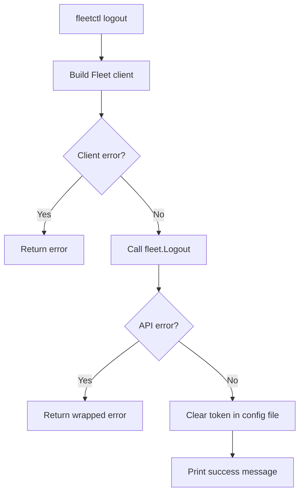

<!-- source-hash: 45bbaa1f49aa13da5150109b729e6b91 -->
Implements the `logout` CLI command for `fleetctl`, which terminates the active Fleet session and clears the locally stored authentication token.

## Key Components

- **`logoutCommand()`** — Returns a `*cli.Command` that handles user logout. It accepts `--config`, `--context`, and `--debug` flags, calls the Fleet API to invalidate the session, then zeroes out the token in the local config file.

## Usage Example

```bash
# Log out of the default context
fleetctl logout

# Log out of a specific context using a custom config file
fleetctl logout --config ~/.fleet/config --context staging
```

```go
// Programmatic registration (from the parent command setup)
app.Commands = append(app.Commands, logoutCommand())
```

## Flow



## Notes

- The token is cleared by writing an empty string to the `token` key via `setConfigValue`, ensuring subsequent commands require re-authentication.
- Source: [`fleetctl/logout.go`](https://github.com/flamingo-stack/fleetmdm/blob/main/fleetctl/logout.go)