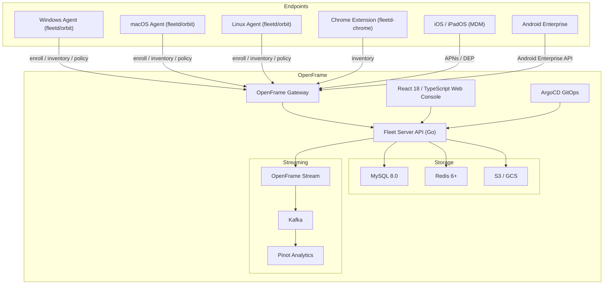
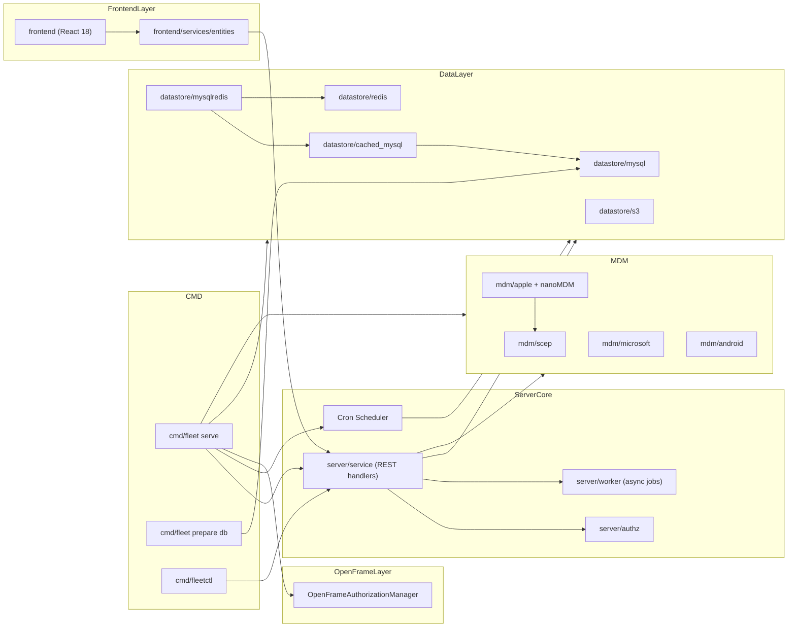
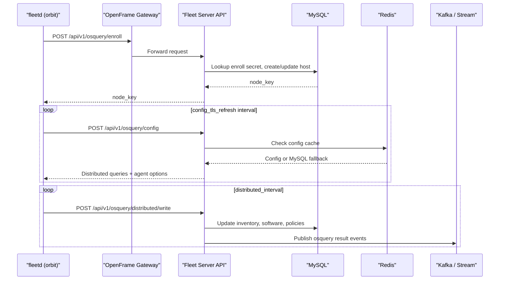
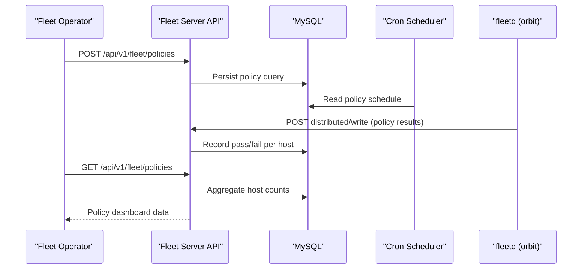

# Architecture Overview

FleetMDM is a multi-layer system integrating a Go backend server, a React web console, cross-platform device agents, and OpenFrame streaming infrastructure. This document describes the high-level architecture, key design patterns, and data flows.

## High-Level Architecture

## Core Components

| Component | Location | Language | Responsibility |
|---|---|---|---|
| Fleet Server | `cmd/fleet/` | Go | HTTP API server, cron scheduling, business logic |
| Fleet Client Library | `client/` | Go | HTTP client for orbit, device, and base API calls |
| Orbit Agent | `orbit/` | Go | Device-side agent: enrollment, config polling, MDM bridge |
| MySQL Datastore | `server/datastore/mysql/` | Go | Primary persistence: inventory, policies, software, jobs |
| Redis Layer | `server/datastore/redis/` | Go | Caching, live query pub/sub, host status tracking |
| S3 Store | `server/datastore/s3/` | Go | Software installer files, bootstrap packages, carves |
| Cron Scheduler | `cmd/fleet/cron.go` | Go | Vulnerability scanning, MDM reconciliation, cleanups |
| Apple MDM Stack | `server/mdm/apple/` | Go | APNs push, nanoMDM, DEP, SCEP, VPP |
| Microsoft MDM | `server/mdm/microsoft/` | Go | Windows MDM protocol, Entra integration, WinGet |
| Android MDM | `server/mdm/android/` | Go | Android Enterprise service, ONC profiles |
| Vulnerability Engine | `server/vulnerabilities/` | Go | NVD/CVE/MSRC/OSV/OVAL scanning |
| OpenFrame Integration | `server/service/openframe/` | Go | Multitenancy auth manager, token rotation |
| Web Console | `frontend/` | React 18 / TypeScript | Operator UI for all management workflows |
| Chrome Extension | `ee/fleetd-chrome/` | TypeScript | Browser-based osquery agent for ChromeOS |
| `fleetctl` CLI | `cmd/fleetctl/` | Go | GitOps apply, query runner, package builder |
| Maintained Apps | `ee/maintained-apps/` | Go | Software catalog ingestion (Homebrew, WinGet) |

## Component Relationships

## Data Flow: Agent Enrollment and Inventory

## Data Flow: Policy Compliance

## Key Design Decisions

### Separation of Read and Write Paths

The MySQL datastore supports primary/replica topology. Write operations always go to the primary; read operations can route to a replica unless `ctxdb.RequirePrimary` is set in the request context. This is managed transparently by the `reader()` / `writer()` helpers in `server/datastore/mysql/mysql.go`.

### Redis-Backed Caching Layer

Frequently accessed data (host config, app config, labels) is cached in Redis via the `cached_mysql` datastore wrapper. The cache TTL for live queries is 1 second to balance freshness and load.

### OpenFrame Multitenancy

In OpenFrame mode, the Fleet server authenticates its outbound requests to the OpenFrame Gateway using rotating JWT tokens managed by `OpenFrameAuthorizationManager` — a thread-safe struct using `sync.RWMutex`. Tenants are isolated at the database level using a `team_id` scoping pattern extended with OpenFrame-specific migrations.

### Cron Job Architecture

All scheduled work (vulnerability scanning, MDM profile reconciliation, policy automation, telemetry) runs through a centralized cron scheduler registered in `cmd/fleet/cron_registration.go`. Each cron job acquires a distributed lock via Redis to prevent duplicate execution in multi-server deployments.

### Frontend State Management

The React frontend uses `react-query` for server-state management (caching, refetching, background sync) and React Context for global UI state (current user, app config, notifications). There is no Redux or external global state store.

## Key Files Reference

| File | Purpose |
|---|---|
| `cmd/fleet/main.go` | Server binary entry point, Cobra command setup |
| `cmd/fleet/serve.go` | Server bootstrap — wires all subsystems together |
| `cmd/fleet/cron.go` | Cron job definitions and scheduling logic |
| `server/service/handler.go` | HTTP route registration for all REST endpoints |
| `server/fleet/datastore.go` | `Datastore` interface — contracts for all persistence operations |
| `server/fleet/service.go` | `Service` interface — contracts for all business logic |
| `server/datastore/mysql/mysql.go` | MySQL datastore implementation |
| `server/service/openframe/openframe_authorization_manager.go` | OpenFrame auth token management |
| `frontend/index.jsx` | React app entry point (Webpack entrypoint) |
| `frontend/router/index.tsx` | Client-side route definitions |

## Reference Documentation

For deeper details, see the full reference documentation:

- [Architecture Reference](./reference/architecture/overview.md)
