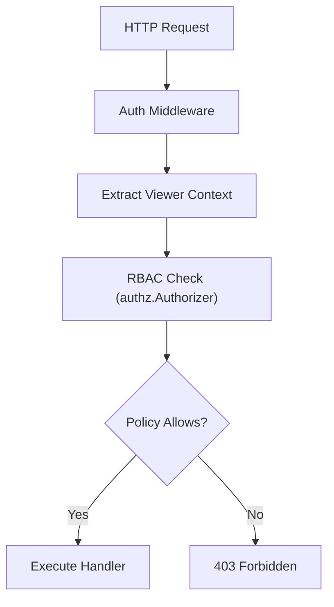

# Security Guidelines

This document describes the security patterns, practices, and controls used in FleetMDM. All contributors should follow these guidelines when writing or reviewing code.

## Authentication and Authorization

### Authentication Mechanisms

FleetMDM supports multiple authentication methods:

| Method | Used By | Implementation |
|---|---|---|
| Session tokens (JWT-like) | Web console users | `server/authz`, `server/contexts/viewer` |
| API keys | `fleetctl` CLI, API clients | `server/service/middleware/auth/api_only.go` |
| osquery node keys | Device agents (fleetd/orbit) | `server/service/osquery_header_auth.go` |
| Device tokens | Fleet Desktop (self-service) | `server/contexts/token` |
| SSO / SAML | Enterprise users | `server/sso/` |
| SCIM provisioning | IdP user sync | `ee/server/scim/` |
| OpenFrame tokens | OpenFrame Gateway integration | `server/service/openframe/` |

### Authorization (RBAC)

Fleet uses a role-based access control system defined in `server/authz/`:



**Roles:**

| Role | Scope | Capabilities |
|---|---|---|
| Global Admin | All teams | Full access to all resources and settings |
| Global Maintainer | All teams | Manage hosts, policies, queries, software |
| Global Observer | All teams | Read-only access |
| Global Observer+ | All teams | Observer + run live queries |
| Team Admin | One team | Admin within that team |
| Team Maintainer | One team | Maintainer within that team |
| Team Observer | One team | Read-only within that team |
| GitOps | N/A | Apply GitOps configurations only |

Every handler uses `authz.Authorize(ctx, entity, action)` before accessing data. Authorization policies are defined in `server/fleet/authz.go`.

### OpenFrame Auth Token Management

The `OpenFrameAuthorizationManager` in `server/service/openframe/` manages rotating JWT tokens for OpenFrame Gateway authentication:

```go
// Thread-safe token storage
mgr := openframe.NewOpenFrameAuthorizationManager()
mgr.UpdateToken(newToken)  // write lock
token := mgr.GetToken()    // read lock (concurrent reads safe)
```

Token rotation happens on a background goroutine. Never store or log these tokens.

---

## Secrets and Environment Variables Management

### Rules for Secrets

1. **Never commit secrets** to the repository — not in code, YAML, or comments
2. **Never log secrets** — audit all `log.*` calls for sensitive data
3. **Use environment variables** for all credentials in all environments
4. **Use a secrets manager** (AWS Secrets Manager, HashiCorp Vault, etc.) in production

### Required Secret Variables

| Variable | Description |
|---|---|
| `FLEET_MYSQL_PASSWORD` | MySQL database password |
| `FLEET_REDIS_PASSWORD` | Redis authentication password (if configured) |
| `FLEET_SERVER_PRIVATE_KEY` | 32-byte key for encrypted database fields |
| `FLEET_MDM_APPLE_APNS_KEY_PEM` | Apple Push Notification service private key |
| OpenFrame Gateway tokens | Managed by `OpenFrameAuthorizationManager` at runtime |

### Server Private Key

Fleet encrypts sensitive data at rest (disk encryption keys, MDM certificates, enroll secrets) using the `FLEET_SERVER_PRIVATE_KEY`. This must be:

- Exactly 32 bytes (256 bits)
- Random and unique per environment
- Rotated according to your organization's key rotation policy
- Backed up securely (loss means loss of encrypted data)

```bash
# Generate a new private key
openssl rand -hex 16   # 32-character hex = 16 bytes raw... use:
openssl rand -base64 24 | head -c 32
```

---

## Data Encryption

### Encryption at Rest

Sensitive fields in MySQL are encrypted using AES-256 via the private key:

- Host disk encryption keys (FileVault, BitLocker recovery keys)
- MDM certificate private keys
- Secret variables defined by operators

Implementation: `server/crypto/aes.go`

### TLS in Transit

In production, always enable TLS for the Fleet server:

```bash
FLEET_SERVER_TLS=true \
FLEET_SERVER_CERT=/path/to/cert.pem \
FLEET_SERVER_KEY=/path/to/key.pem \
fleet serve
```

All agent-to-server and browser-to-server communication must use HTTPS. The Fleet server enforces this in production mode.

### MDM Certificate Security

Apple MDM requires:
- An APNs (Apple Push Notification service) certificate for device push
- A SCEP depot certificate for device identity
- A DEP token for automated enrollment

These are stored in the database encrypted with the server private key. Rotate them before expiry using the MDM settings UI or `fleetctl mdm`.

---

## Input Validation and Sanitization

### Backend Validation

All API request structs must validate their inputs before processing. Use the validation helpers in `server/service/validation_setup.go` and entity-specific validators.

Key patterns:

```go
// Always validate required fields
if req.Name == "" {
    return nil, fleet.NewInvalidArgumentError("name", "Name is required")
}

// Validate lengths and formats
if len(req.Script) > maxScriptLength {
    return nil, fleet.NewInvalidArgumentError("script", "Script exceeds maximum size")
}
```

### SQL Injection Prevention

All database queries use parameterized statements via `sqlx`. Never use string concatenation to build SQL queries:

```go
// CORRECT — parameterized query
err = ds.writer(ctx).SelectContext(ctx, &hosts, `
    SELECT * FROM hosts WHERE team_id = ?
`, teamID)

// WRONG — string concatenation (SQL injection risk)
err = ds.writer(ctx).SelectContext(ctx, &hosts,
    "SELECT * FROM hosts WHERE team_id = "+teamID)
```

### Frontend XSS Prevention

The React frontend uses:

- **DOMPurify** (`dompurify` package) to sanitize any HTML rendered from user-provided content
- React's built-in JSX escaping for all dynamic values rendered in the DOM
- `react-markdown` with GFM for rendering Markdown safely

Never use `dangerouslySetInnerHTML` without sanitizing input with DOMPurify first.

---

## Common Security Vulnerabilities and Mitigations

| Vulnerability | Mitigation in FleetMDM |
|---|---|
| SQL Injection | All queries use `sqlx` parameterized statements |
| XSS | DOMPurify sanitization; React JSX auto-escaping |
| CSRF | Session tokens validated on every state-changing request |
| Insecure Direct Object Reference | RBAC authz check on every handler before data access |
| Secret leakage | Redact helper in `ee/fleet-agent-downloader/api/helpers/redact-user.go`; secrets never logged |
| Insecure TLS | TLS 1.2+ enforced; H2C available for trusted internal networks only |
| Privilege escalation | Role checked server-side; never trust client-side role claims |
| Path traversal | File uploads validated for type and size; no user-controlled path components |
| Race conditions | Distributed Redis locks for cron jobs; `sync.RWMutex` for shared state |

---

## Security Testing

### Static Analysis

Run these tools before submitting a PR:

```bash
# Go static analysis
staticcheck ./...

# Race condition detector
go test -race ./server/...

# Lint checks (includes security-related rules)
npx eslint frontend/ --max-warnings=0
```

### Integration Test Coverage

Security-sensitive paths have dedicated integration tests in:

- `server/service/integrationtest/` — REST API security tests
- `ee/server/integrationtest/` — enterprise feature security tests

Run them with:

```bash
MYSQL_TEST_DATABASE=fleet go test ./server/service/integrationtest/... -v
```

### Code Review Security Checklist

When reviewing PRs, verify:

- [ ] No secrets or credentials committed
- [ ] All new endpoints have `authz.Authorize()` calls
- [ ] New database queries use parameterized statements
- [ ] User-controlled data rendered in HTML goes through DOMPurify
- [ ] File upload handlers validate type and size
- [ ] New cron jobs acquire distributed locks
- [ ] Error messages don't leak internal implementation details
- [ ] New environment variables documented (not hardcoded values)
