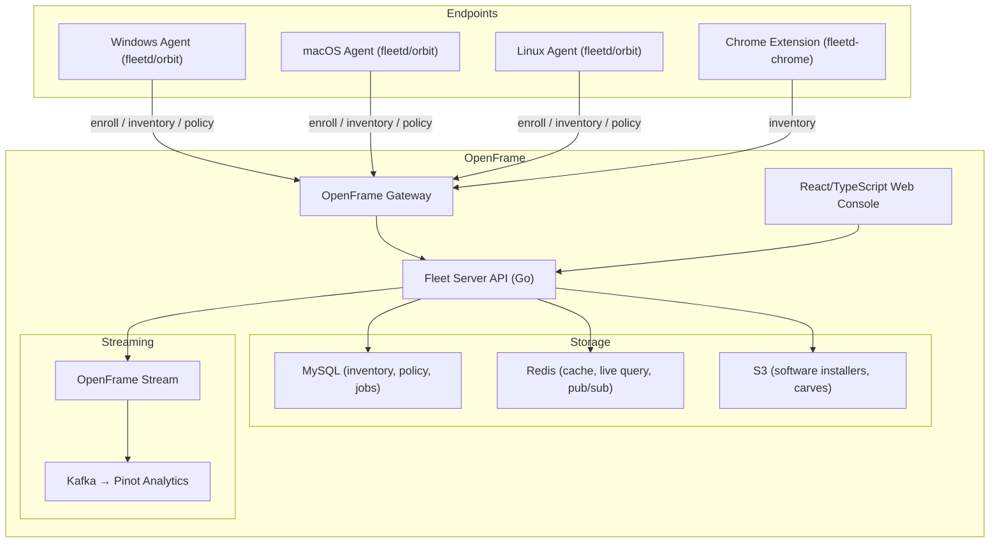

# Introduction to FleetMDM

**FleetMDM** is Flamingo's integration of the open-source Fleet device management platform into the [OpenFrame](https://openframe.ai) unified MSP ecosystem. It provides cross-platform device management for Windows, macOS, Linux, ChromeOS, iOS/iPadOS, and Android devices — powered by osquery agents, MDM protocols, and AI-driven automation from Flamingo.

## What is FleetMDM?

FleetMDM brings together:

- **Device inventory and telemetry** via the `fleetd` (orbit) agent and osquery
- **Policy enforcement and compliance reporting** with live SQL queries across your fleet
- **Software management** — install, update, and uninstall packages at scale
- **MDM commands** for Apple (APNs/DEP), Windows (Entra/SCEP), and Android Enterprise
- **Vulnerability scanning** against NVD, OVAL, MSRC, and OSV databases
- **OpenFrame integration** — routing through the OpenFrame Gateway with tenant-aware auth

This repository is the `flamingo-stack/fleetmdm` fork, adding OpenFrame multitenancy, streaming analytics (Kafka/Pinot), and Flamingo AI capabilities on top of the upstream Fleet codebase.

## Key Features

| Feature | Description |
|---|---|
| Cross-platform MDM | Manage macOS, iOS/iPadOS, Windows, Linux, Android, and ChromeOS from one console |
| osquery-powered inventory | Real-time SQL queries against device hardware, software, users, and processes |
| Policy automation | Define compliance policies; automatically install software or run scripts on failure |
| Vulnerability management | Continuous CVE scanning with CVSS scoring and exploit probability |
| GitOps support | Manage all Fleet configuration as code via `fleetctl gitops` |
| Self-service portal | End users can install approved software without IT tickets |
| OpenFrame streaming | Publish inventory and compliance events to Kafka → Cassandra → Pinot |
| SCIM provisioning | Sync users and groups from your IdP automatically |

## Target Audience

FleetMDM is designed for:

- **Flamingo MSP partners** integrating device management into OpenFrame
- **IT administrators** managing cross-platform endpoint fleets
- **Security engineers** tracking vulnerabilities and enforcing compliance policies
- **Developers** extending Fleet with custom osquery tables, scripts, and automations

## Architecture at a Glance

## Core Components

| Component | Language | Role |
|---|---|---|
| Fleet Server (`cmd/fleet/`) | Go | Main API server, cron scheduling, MDM orchestration |
| Web Console (`frontend/`) | React 18 / TypeScript | Operator UI for managing devices, policies, and software |
| `fleetd` / orbit agent | Go | Device-side agent: enrollment, config polling, script execution |
| MySQL Datastore | Go | Primary persistence for inventory, policies, software |
| Redis | Go | Caching, live query pub/sub, host lookup |
| MDM stacks (`server/mdm/`) | Go | Apple (nanoMDM/SCEP), Microsoft (Entra), Android Enterprise |
| OpenFrame Integration | Go | Multitenancy auth manager, Gateway token rotation |
| `fleetctl` CLI | Go | GitOps apply, query runner, package builder |

## Project Links

- **Repository:** [github.com/flamingo-stack/fleetmdm](https://github.com/flamingo-stack/fleetmdm)
- **Flamingo Platform:** [flamingo.run](https://flamingo.run)
- **OpenFrame:** [openframe.ai](https://openframe.ai)
- **Community Slack:** [openmsp.ai](https://www.openmsp.ai/)

## Where to Go Next

- Review the [Prerequisites](prerequisites.md) to ensure your system is ready
- Follow the [Quick Start](quick-start.md) to get Fleet running in minutes
- Work through the [First Steps](first-steps.md) after your initial deployment
