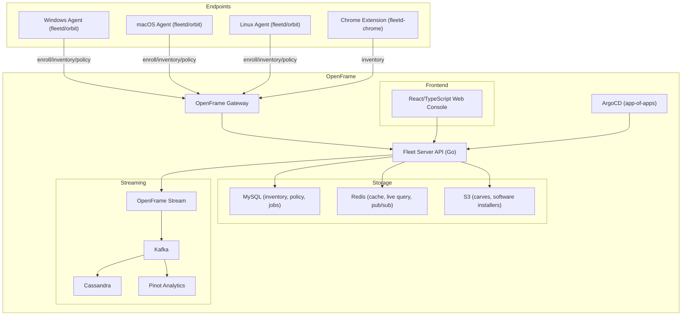
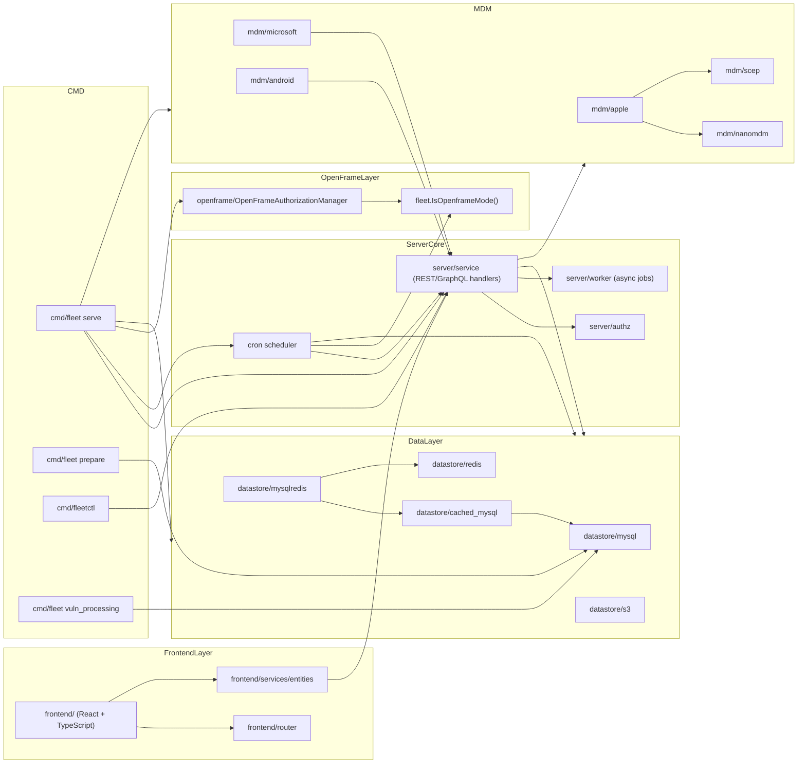
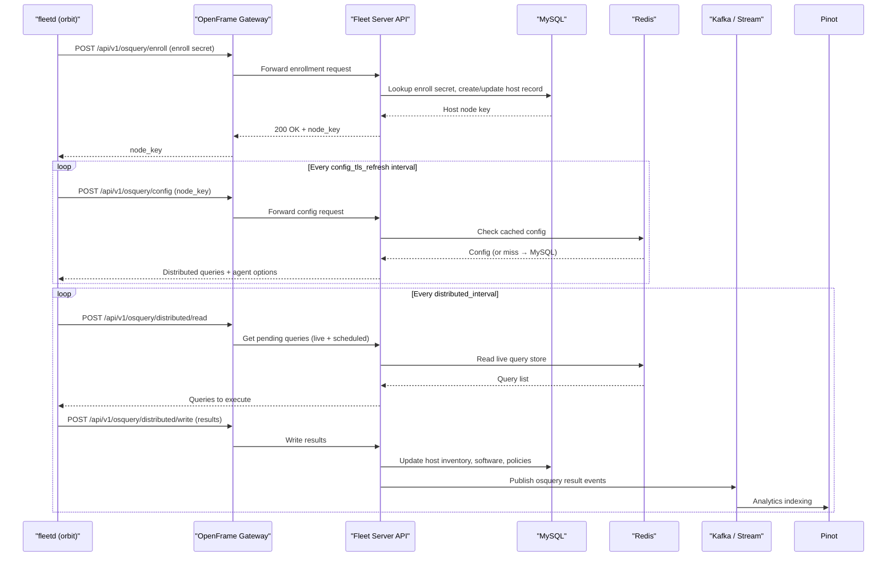
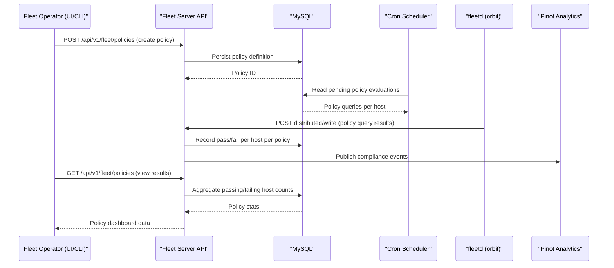

# fleetmdm Module Documentation

# FleetMDM — Architecture Documentation

## Overview

FleetMDM is Flamingo's integration of the open-source Fleet device management platform into the OpenFrame unified MSP ecosystem. It provides cross-platform device management (Windows, macOS, Linux) via osquery agents, exposing inventory, policy enforcement, software management, remote actions, and compliance reporting through OpenFrame's Gateway, Stream (Kafka), and Analytics (Pinot) infrastructure.

---

## Architecture

### High-Level System Architecture



---

## Core Components

| Component | Location | Language | Responsibility |
|---|---|---|---|
| Fleet Server | `cmd/fleet/` | Go | Main HTTP/gRPC server: routing, auth, business logic, cron scheduling |
| Fleet Client Library | `client/` | Go | HTTP client abstractions for orbit, device, and base API calls |
| Orbit Agent Client | `client/orbit_client.go` | Go | Agent-side client: enrollment, config polling, OpenFrame auth mode |
| Device Client | `client/device_client.go` | Go | Fleet Desktop / self-service device-facing API client |
| MySQL Datastore | `server/datastore/mysql/` | Go | Primary persistence layer for all Fleet entities |
| Redis Layer | `cmd/fleet/redis.go` | Go | Caching (cached_mysql), host lookup, live query pub/sub, key-value |
| Cron Scheduler | `cmd/fleet/cron.go`, `cron_registration.go` | Go | Scheduled jobs: vulnerability scanning, cleanups, MDM, telemetry |
| Apple MDM Stack | `cmd/fleet/mdm_apple.go`, `server/mdm/apple/` | Go | APNs push, DEP storage, SCEP depot, MDM commands |
| Microsoft MDM | `server/mdm/microsoft/` | Go | Windows MDM protocol, Entra/Azure integration |
| Android MDM | `server/mdm/android/` | Go | Android Enterprise service |
| Vulnerability Engine | `cmd/fleet/cron.go`, `server/vulnerabilities/` | Go | NVD/CVE/MSRC/OSV/OVAL scanning, CPE matching |
| OpenFrame Integration | `server/service/openframe/` | Go | OpenFrame auth manager, mode flags, tool registration |
| Web Console | `frontend/` | TypeScript/React | Operator UI, device views, policy, software, reporting |
| Chrome Extension | `ee/fleetd-chrome/` | TypeScript | Browser-based osquery agent for ChromeOS |
| osquery-perf | `cmd/osquery-perf/` | Go | Load testing agent simulator |
| fleetctl CLI | `cmd/fleetctl/` | Go | Operator CLI: apply configs, run queries, manage updates |
| Maintained Apps | `ee/maintained-apps/` | Go | Fleet-curated software catalog ingestion (Homebrew, WinGet) |
| OTEL Observability | `cmd/fleet/otel.go` | Go | OpenTelemetry trace, metric, and log providers for SigNoz |

---

## Component Relationships



---

## Data Flow

### Agent Enrollment and Inventory Collection



### Policy and Compliance Flow



---

## Key Files

| File | Purpose |
|---|---|
| [`cmd/fleet/serve.go`](https://github.com/flamingo-stack/fleetmdm/blob/main/cmd/fleet/serve.go) | Entry point for `fleet serve`: wires all subsystems, starts HTTP server |
| [`cmd/fleet/cron_registration.go`](https://github.com/flamingo-stack/fleetmdm/blob/main/cmd/fleet/cron_registration.go) | Registers all cron schedules grouped by domain |
| [`cmd/fleet/cron.go`](https://github.com/flamingo-stack/fleetmdm/blob/main/cmd/fleet/cron.go) | Vulnerability scanning cron logic, vuln path config |
| [`cmd/fleet/prepare.go`](https://github.com/flamingo-stack/fleetmdm/blob/main/cmd/fleet/prepare.go) | `fleet prepare db`: runs MySQL migrations including OpenFrame schema |
| [`cmd/fleet/redis.go`](https://github.com/flamingo-stack/fleetmdm/blob/main/cmd/fleet/redis.go) | Redis pool setup, cached_mysql and mysqlredis wrapping |
| [`cmd/fleet/datastore.go`](https://github.com/flamingo-stack/fleetmdm/blob/main/cmd/fleet/datastore.go) | MySQL datastore init, S3 carve store, migration status evaluation |
| [`cmd/fleet/mdm_apple.go`](https://github.com/flamingo-stack/fleetmdm/blob/main/cmd/fleet/mdm_apple.go) | Apple MDM storage (NanoMDM, DEP, SCEP) init and APNs push service |
| [`cmd/fleet/otel.go`](https://github.com/flamingo-stack/fleetmdm/blob/main/cmd/fleet/otel.go) | OpenTelemetry trace, metric, and log provider initialization |
| [`cmd/fleet/logging.go`](https://github.com/flamingo-stack/fleetmdm/blob/main/cmd/fleet/logging.go) | osquery status/result/audit JSON logger setup |
| [`client/base_client.go`](https://github.com/flamingo-stack/fleetmdm/blob/main/client/base_client.go) | Shared HTTP client: response parsing, capability negotiation |
| [`client/orbit_client.go`](https://github.com/flamingo-stack/fleetmdm/blob/main/client/orbit_client.go) | Orbit agent HTTP client: enrollment, config polling, OpenFrame auth |
| [`client/device_client.go`](https://github.com/flamingo-stack/fleetmdm/blob/main/client/device_client.go) | Fleet Desktop device-facing API client with token retry logic |
| [`client/base_client_errors.go`](https://github.com/flamingo-stack/fleetmdm/blob/main/client/base_client_errors.go) | Typed error types (NotFound, Conflict, Unauthenticated, etc.) |
| [`server/utils.go`](https://github.com/flamingo-stack/fleetmdm/blob/main/server/utils.go) | Crypto helpers, random text/email/password generation, template loading |
| [`frontend/index.jsx`](https://github.com/flamingo-stack/fleetmdm/blob/main/frontend/index.jsx) | React app entry point, theme initialization |
| [`frontend/context/app.tsx`](https://github.com/flamingo-stack/fleetmdm/blob/main/frontend/context/app.tsx) | Global app context: user, teams, config, license state |
| [`webpack.config.js`](https://github.com/flamingo-stack/fleetmdm/blob/main/webpack.config.js) | Frontend build: esbuild-loader, SCSS pipeline, asset bundling |
| [`ee/maintained-apps/maintained_apps.go`](https://github.com/flamingo-stack/fleetmdm/blob/main/ee/maintained-apps/maintained_apps.go) | Fleet-maintained app catalog data model and ingestion interface |
| [`ee/fleetd-chrome/webpack.common.js`](https://github.com/flamingo-stack/fleetmdm/blob/main/ee/fleetd-chrome/webpack.common.js) | Chrome extension build config |

---

## Dependencies

FleetMDM integrates several major dependency categories:

### Go Backend

| Dependency | Role |
|---|---|
| `github.com/go-kit/kit` | Service layer middleware (metrics, logging, transport) |
| `github.com/spf13/cobra` | CLI framework for `fleet` and `fleetctl` commands |
| `github.com/jmoiron/sqlx` + `go-sql-driver/mysql` | MySQL access via `server/datastore/mysql` |
| `github.com/go-redis/redis` | Redis pool used in `datastore/redis`, live query, and pub/sub |
| `github.com/WatchBeam/clock` | Testable clock abstraction for time-sensitive datastore operations |
| `github.com/google/uuid` | UUID generation for host identifiers and execution IDs |
| `go.opentelemetry.io/otel` | Distributed tracing, metrics, and log export (SigNoz/OTLP) |
| `github.com/prometheus/client_golang` | Prometheus metrics exposition |
| `github.com/rs/zerolog` | Structured logging in orbit/device clients |
| `github.com/theupdateframework/go-tuf` | TUF-compliant update repository management (`fleetctl updates`) |
| `github.com/pandatix/nvdapi` | NVD API v2 client for CPE/CVE feed ingestion |
| `github.com/micromdm/plist` | Apple plist serialization for MDM payloads |
| NanoMDM libraries | Apple MDM protocol, APNs push (buford), SCEP depot |
| `google.golang.org/grpc` | gRPC server for launcher/osquery protocol |
| `go.elastic.co/apm` | Elastic APM tracing integration (optional) |
| `github.com/getsentry/sentry-go` | Error tracking integration |
| `github.com/throttled/throttled` | API rate limiting middleware |

### Frontend (TypeScript/React)

| Dependency | Role |
|---|---|
| `react` + `react-dom` | UI framework, rendered via `createRoot` |
| `react-router` | Client-side routing in `frontend/router` |
| `axios` | HTTP client for API calls in `frontend/services/entities` |
| `react-query` | Server state management and caching |
| `@typescript-eslint` | TypeScript linting rules |
| `webpack` + `esbuild-loader` | Fast transpilation of TSX/JSX to ES2016 |
| `sass-loader` + `node-bourbon` | SCSS compilation with bourbon mixins |
| `@storybook/react-webpack5` | Component development and visual testing |
| `jest` + `ts-jest` | Unit and integration test runner |

### OpenFrame-Specific Extensions

The following custom integrations are layered on top of upstream Fleet:

| Extension | Location | Purpose |
|---|---|---|
| `openframe.OpenFrameAuthorizationManager` | `server/service/openframe/` | JWT/OIDC bearer token auth for orbit agents in OpenFrame mode |
| `fleet.IsOpenframeMode()` / `IsOpenframeMultitenancy()` | `server/fleet/` | Feature flags controlling OpenFrame-specific code paths |
| `ds.MigrateOpenframe()` | `cmd/fleet/prepare.go` | OpenFrame-only DB schema (host assignments tables) |
| `ds.AcquireOpenframeMigrationLock()` | `cmd/fleet/prepare.go` | MySQL advisory lock for shared-MySQL multi-tenant migration serialization |
| `newQueryResultsTTLCleanupSchedule` | `cmd/fleet/cron_registration.go` | Time-based query result cleanup for OpenFrame deployments |
| Redis `KeyPrefix` | `cmd/fleet/redis.go` | Per-tenant Redis key namespacing |

---

## CLI Commands

### `fleet` Server Binary

```bash
# Initialize the database schema
fleet prepare db [--no-prompt] [--dev] [--with-table-stats]

# Start the Fleet server
fleet serve [--debug] [--dev] [--dev_license] [--dev_expired_license]

# Run standalone vulnerability processing
fleet vuln_processing [--dev] [--dev_license] [--lock_duration=60m]

# Dump merged configuration as YAML
fleet config_dump

# Print version information
fleet version [--full]
```

### `fleetctl` Operator CLI

```bash
# Apply configuration (teams, queries, policies, agent options)
fleetctl apply -f config.yml

# Run a live query across hosts
fleetctl query --hosts hostname --query "SELECT * FROM os_version"

# Manage TUF update repository (Linux/macOS only)
fleetctl updates init --path ./repo
fleetctl updates add --path ./repo --target ./fleetd
fleetctl updates timestamp --path ./repo
fleetctl updates rotate --path ./repo

# Interactive osquery shell (goquery)
fleetctl query --host <uuid>

# Login / logout
fleetctl login --url https://fleet.example.com
fleetctl logout
```

### Kubernetes Deployment (OpenFrame)

```bash
# Deploy full OpenFrame stack (FleetMDM included via app-of-apps)
helm install openframe ./manifests/app-of-apps

# Deploy FleetMDM standalone (registration job will fail without OpenFrame)
helm install fleetmdm ./manifests/integrated-tools/fleetmdm

# Check FleetMDM pod status
kubectl get pods -n integrated-tools -l app=fleetmdm-server

# Retrieve auto-generated API token
kubectl exec -it fleetmdm-server-0 -n integrated-tools -- cat /etc/fleet/api_token.txt

# Access Fleet UI via Telepresence
telepresence connect --namespace integrated-tools
# Then open: http://fleetmdm-server.integrated-tools.svc.cluster.local:8070
```

### Code Generation Tools

```bash
# Generate CPE SQLite database from NVD API
NVD_API_KEY=<key> go run cmd/cpe/generate.go

# Generate CVE vulnerability feeds
go run cmd/cve/generate.go --db_dir /tmp/vulndbs

# Generate Mac Office vulnerability metadata
go run cmd/macoffice/generate.go

# Generate MSRC (Windows) security bulletins
go run cmd/msrc/generate.go

# Process OSV vulnerability data (Ubuntu/RHEL)
go run cmd/osv-processor/main.go --platform ubuntu --input /tmp/ubuntu-osv

# Ingest maintained app manifests (Homebrew/WinGet)
go run cmd/maintained-apps/main.go [--slug <app-slug>]

# Run osquery agent simulator for load testing
go run cmd/osquery-perf/agent.go --host_count 100 --server_url https://fleet.example.com
```

---

## Community & Support

- **Community:** [OpenMSP Slack](https://www.openmsp.ai/)
- **Documentation:** [flamingo.run/knowledge-base](https://www.flamingo.run/knowledge-base)
- **Security:** security@flamingo.run
- **Source:** [github.com/flamingo-stack/fleetmdm](https://github.com/flamingo-stack/fleetmdm)
- **Fleet Official Docs:** [fleetdm.com/docs](https://fleetdm.com/docs)
- **osquery Tables Reference:** [osquery.io/schema](https://osquery.io/schema)
