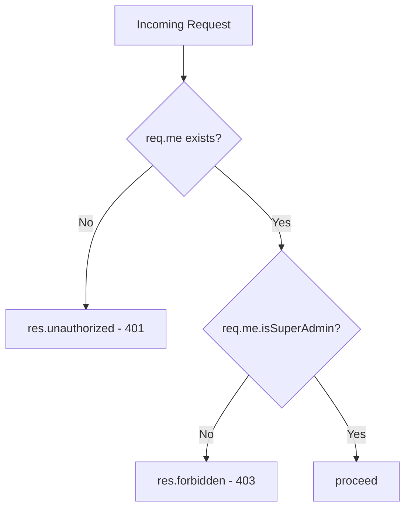

<!-- source-hash: 8e5f272e50b215236a74c549fd051404 -->
A Sails.js policy middleware that restricts route access to authenticated super-admin users only.

## Key Components

- **`module.exports`** — Async middleware function following the Sails.js policy signature `(req, res, proceed)`
- **`req.me`** — Populated by the custom hook at `api/hooks/custom/index.js`; represents the currently authenticated user
- **`req.me.isSuperAdmin`** — Boolean flag checked to verify super-admin privileges

## Logic Flow



## Usage Example

Attach this policy to any route or controller action in `config/policies.js`:

```javascript
// config/policies.js
module.exports.policies = {
  // Protect a single action
  'admin/UserController': {
    '*': ['is-super-admin']
  },

  // Protect a specific action
  'SettingsController': {
    deleteAllData: ['is-super-admin']
  }
};
```

## Responses

| Condition | Response |
|-----------|----------|
| User is not logged in | `401 Unauthorized` |
| User lacks super-admin flag | `403 Forbidden` |
| User is a super-admin | Passes to next handler |

## Source

[`is-super-admin.js`](https://github.com/flamingo-stack/fleetmdm/blob/main/api/policies/is-super-admin.js) — See the [Sails.js policies docs](https://sailsjs.com/docs/concepts/policies) for configuration details.