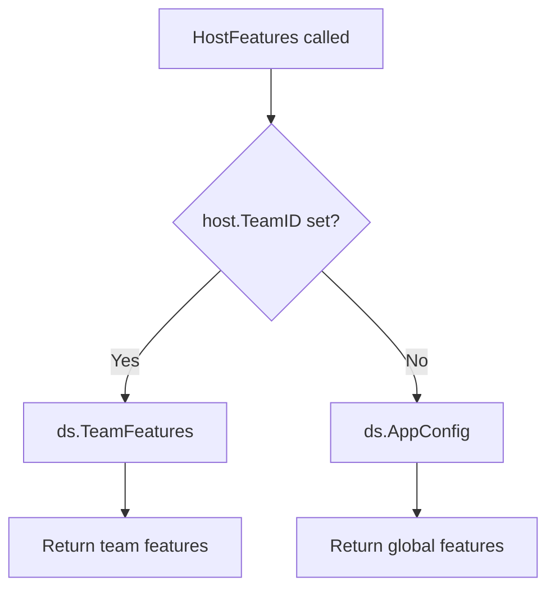

<!-- source-hash: 2967956c274bd9a742d8edfa8721dc65 -->
Retrieves the feature configuration applicable to a given host, resolving whether to use team-level or global app config features based on the host's team membership.

## Key Components

- **`HostFeatures(ctx, host)`** — Returns a `*fleet.Features` struct for the provided host. Delegates to `ds.TeamFeatures` if the host has a `TeamID`, otherwise falls back to `ds.AppConfig` to retrieve global features.

## Usage Example

```go
features, err := svc.HostFeatures(ctx, host)
if err != nil {
    return err
}

if features.EnableHostUsers {
    // feature-gated logic
}
```

## Resolution Logic



> **Note:** Team features start as a mix of global config at team creation time but evolve independently afterward. Changes to global app config do **not** propagate to existing teams.