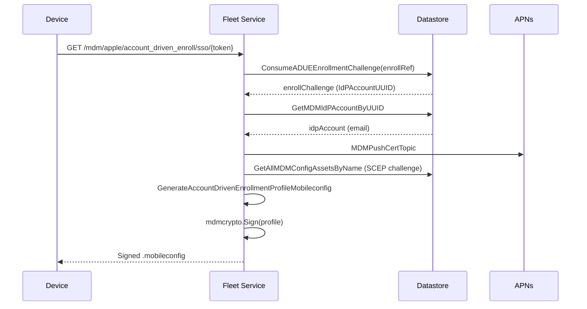

<!-- source-hash: 186be501eedb5f9889ba9ff3ee0e33b5 -->
Handles Apple MDM account-driven enrollment (ADE) by providing the SSO redirect URL and generating signed enrollment profiles for authenticated IdP users.

## Key Components

| Export | Description |
|--------|-------------|
| `GetMDMAccountDrivenEnrollmentSSOURL` | Returns the SSO redirect URL for account-driven MDM enrollment, optionally scoped to a specific enrollment token |
| `GetMDMAppleAccountEnrollmentProfile` | Validates an enrollment challenge, resolves the associated IdP account, and returns a signed `.mobileconfig` enrollment profile |

## Usage Example

```go
// Retrieve the SSO URL for account-driven enrollment
url, err := svc.GetMDMAccountDrivenEnrollmentSSOURL(ctx, "token-abc123")
if err != nil {
    log.Fatal(err)
}
// url → "https://fleet.example.com/mdm/apple/account_driven_enroll/sso/token-abc123"

// Generate and return a signed enrollment profile for a validated enrollment reference
profile, err := svc.GetMDMAppleAccountEnrollmentProfile(ctx, "enroll-ref-xyz")
if err != nil {
    log.Fatal(err)
}
// profile is a CMS-signed .mobileconfig ready to serve to the device
```

## Flow



> **Auth note:** Both endpoints skip standard authorization — `GetMDMAccountDrivenEnrollmentSSOURL` is fully unauthenticated, while `GetMDMAppleAccountEnrollmentProfile` is gated by the one-time enrollment reference consumed from the datastore.