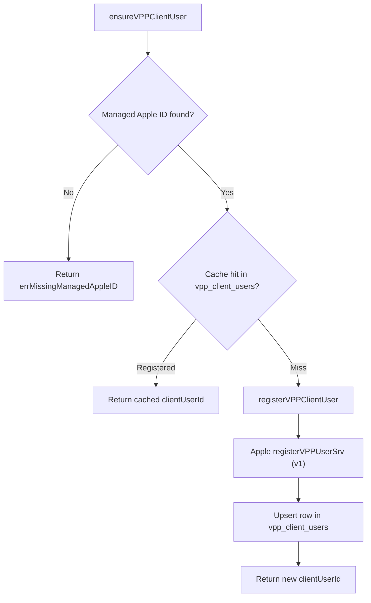

<!-- source-hash: 4ceb40719eeadc0e6a0b7b780e5e92ea -->
Handles VPP (Volume Purchase Program) client user registration for hosts enrolled via Account-Driven User Enrollment (BYOD), mapping Managed Apple IDs to Fleet-generated client user identifiers at a given VPP token location.

## Key Components

- **`errMissingManagedAppleID`** — Sentinel `UserMessageError` (HTTP 422) returned when a host's Managed Apple ID is not yet available post-enrollment.
- **`ensureVPPClientUser`** — Idempotent entry point that returns a cached `clientUserId` from `vpp_client_users` on hits, or delegates to `registerVPPClientUser` on first call / cache miss.
- **`registerVPPClientUser`** — Unconditionally calls Apple's synchronous `registerVPPUserSrv` v1 endpoint, generates a UUID `clientUserId`, and upserts the result into the datastore.

## Usage Example

```go
// Inside an install flow for a user-enrolled (BYOD) host:
clientUserID, err := svc.ensureVPPClientUser(ctx, host, vppToken)
if err != nil {
    // Surface errMissingManagedAppleID to the caller as a retryable error.
    return ctxerr.Wrap(ctx, err, "ensuring vpp client user")
}

// clientUserID is now ready to be used in an Associate Assets request.
err = vpp.AssociateAssets(ctx, vppToken.Token, clientUserID, adamIDs)
```

## Flow

