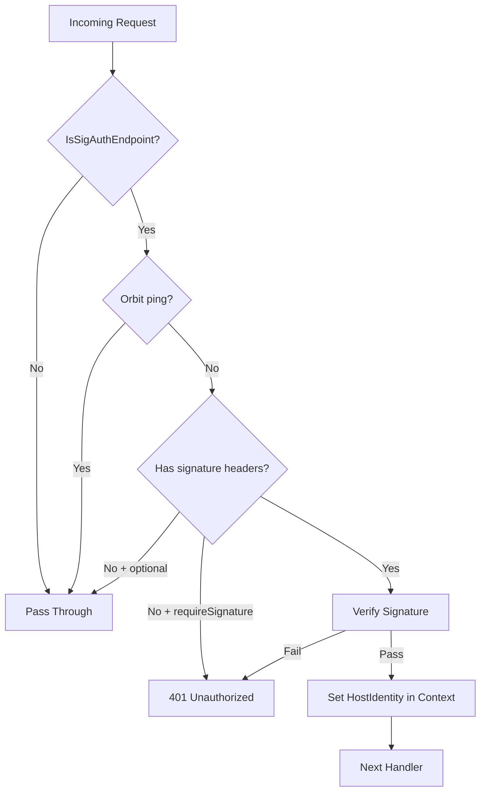

<!-- source-hash: 75e9b4552579cc554b69ebab99bb9bc7 -->
HTTP signature verification middleware that authenticates requests to specific Fleet endpoints using host identity certificates stored in request context.

## Key Components

- **`sigAuthenticatedEndpoints`** — Compiled regex patterns defining which URL paths require signature authentication (certificate authority requests, Orbit API, osquery endpoints)
- **`IsSigAuthEndpoint(path string) bool`** — Checks whether a given URL path matches any signature-authenticated endpoint pattern
- **`NewContext / FromContext`** — Context helpers for storing and retrieving `types.HostIdentityCertificate` values using a typed private key
- **`MiddlewareFunc`** — Type alias for `func(http.Handler) http.Handler`, the standard middleware signature
- **`Middleware(ds, requireSignature, logger)`** — Factory function that initializes an HTTP signature verifier and returns middleware enforcing signature validation on matched endpoints
- **`handleError`** — Internal helper that logs errors via `ctxerr.Handle` and writes an HTTP error response

## Usage Example

```go
sigMiddleware, err := httpsig.Middleware(datastore, true, slog.Default())
if err != nil {
    log.Fatal(err)
}

mux := http.NewServeMux()
mux.Handle("/api/", sigMiddleware(yourHandler))
```

## Authentication Flow



Requests missing `signature` and `signature-input` headers are either rejected (when `requireSignature` is `true`) or passed through unauthenticated. Verified requests have the host identity certificate injected into context for downstream handlers via `FromContext`.