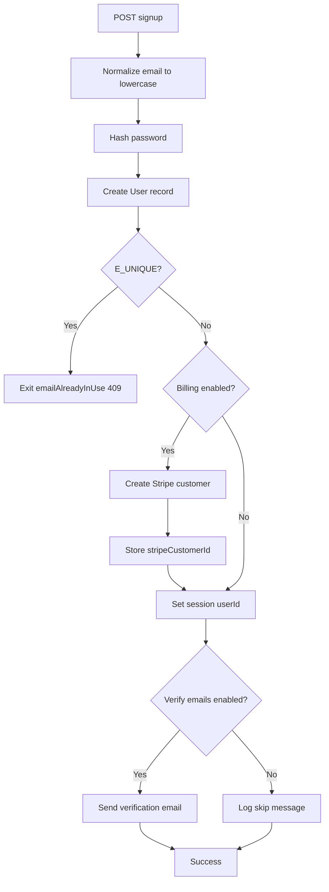

<!-- source-hash: 2640ce6c6464c8abbd17eb41bc454e51 -->
Sails.js action that handles new user registration by creating a database record, optionally integrating with Stripe billing, establishing a session, and sending verification emails.

## Key Components

| Element | Description |
|---|---|
| `emailAddress` | Required, validated email input (normalized to lowercase) |
| `password` | Required string, max 200 chars (hashed via `passwords.hashPassword`) |
| `fullName` | Required string for the user's display name |
| `emailAlreadyInUse` exit | 409 conflict when email is already registered |
| `invalid` exit | 400 bad request for malformed inputs |

## Usage Example

```javascript
// Called via Sails router, e.g. POST /api/v1/entrance/signup
const result = await sails.helpers.callAction('entrance/signup', {
  emailAddress: 'user@example.com',
  password: 'securepassword123',
  fullName: 'Jane Doe'
});
```

## Flow Summary



## Configuration Dependencies

| Config Flag | Behavior When Enabled |
|---|---|
| `verifyEmailAddresses` | Sets `emailStatus: 'unconfirmed'`, generates proof token, sends verification email |
| `enableBillingFeatures` | Creates a Stripe customer record and persists `stripeCustomerId` |
| `sails.hooks.sockets` | Broadcasts session change to other open browser tabs |