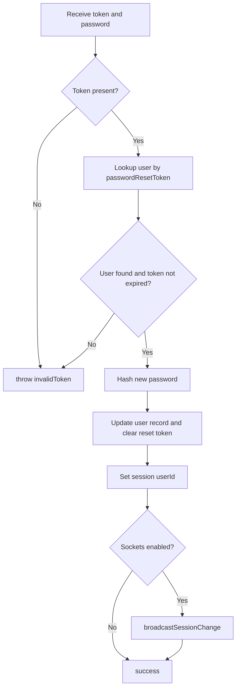

<!-- source-hash: c556dc8dd79613843013e7436db4b9a0 -->
Finalizes the password recovery flow by validating a reset token, hashing the new password, clearing the token, and logging in the user via session.

## Key Components

| Element | Description |
|---|---|
| `password` (input) | The new plaintext password to set |
| `token` (input) | The reset token generated by `sendPasswordRecoveryEmail` |
| `invalidToken` (exit) | Thrown when the token is missing, expired, or already used |
| `success` (exit) | Password updated and user session established |

## Flow



## Usage Example

```javascript
// Called via POST to the corresponding Sails route
const response = await fetch('/api/v1/account/update-password-and-login', {
  method: 'POST',
  headers: { 'Content-Type': 'application/json' },
  body: JSON.stringify({
    password: 'newSecurePassword123',
    token: 'gwa8gs8hgw9h2g9hg29hgwh9asdgh9q34$$$$$asdgasdggds'
  })
});
// On success: user is now logged in via session cookie
// On invalid/expired token: receives 'expired' response type
```

## Notes

- Token expiry is checked against `passwordResetTokenExpiresAt` using `Date.now()`
- The reset token is cleared (`''`) and expiry set to `0` after use, preventing replay attacks
- If `sails.hooks.sockets` is active, `broadcastSessionChange` notifies other open tabs of the session update

**Source:** [`api/controllers/entrance/update-password-and-login.js`](https://github.com/flamingo-stack/fleetmdm/blob/main/api/controllers/entrance/update-password-and-login.js)