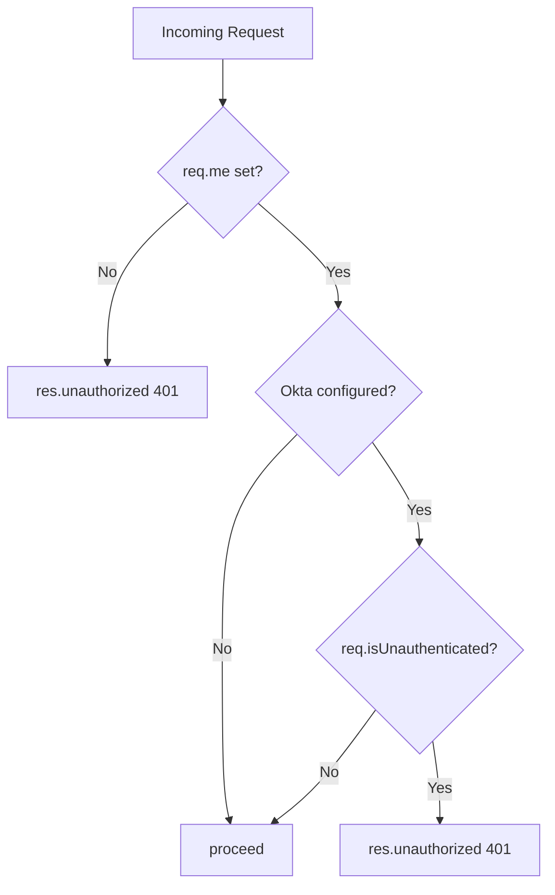

<!-- source-hash: 54a54534f5781ab8dc11a473af36fbc0 -->
A Sails.js middleware policy that gates route access to authenticated users only.

## Key Components

- **`req.me`** — Checks for the presence of the custom `req.me` property (set by the app's custom hook in `api/hooks/custom/index.js`) to determine if the user is authenticated
- **Okta integration check** — When `sails.config.custom.oktaClientSecret` is configured, additionally validates the session via Passport's `req.isUnauthenticated()` to enforce SSO authentication
- **`proceed()`** — Passes control to the next policy or action if the user is authenticated
- **`res.unauthorized()`** — Returns a 401 response for unauthenticated requests

## Usage Example

Apply this policy to controllers or individual actions in `config/policies.js`:

```javascript
// config/policies.js
module.exports.policies = {
  // Protect all actions in UserController
  UserController: {
    '*': 'is-logged-in',
  },

  // Protect a specific action
  DashboardController: {
    index: 'is-logged-in',
  },
};
```

## Authentication Flow



**Source:** [`api/policies/is-logged-in.js`](https://github.com/flamingo-stack/fleetmdm/blob/main/api/policies/is-logged-in.js)