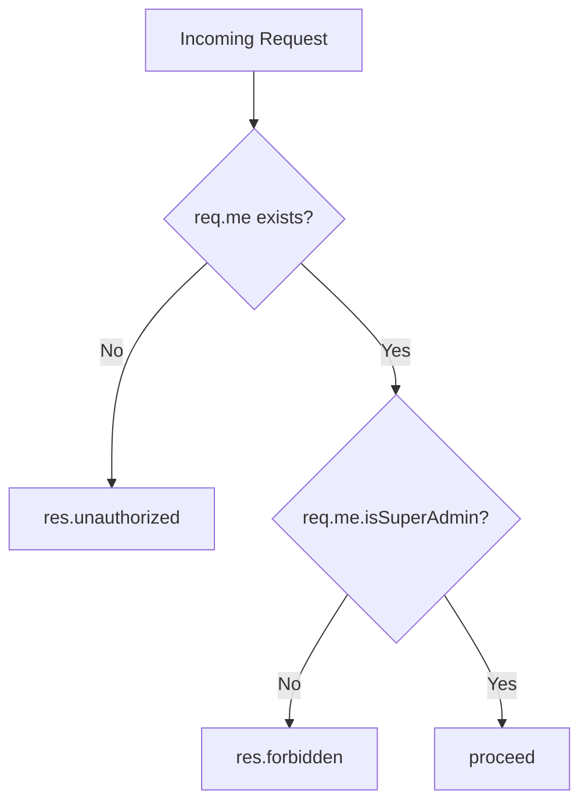

<!-- source-hash: 8e5f272e50b215236a74c549fd051404 -->
A Sails.js middleware policy that restricts route access to authenticated super-admin users only.

## Key Components

- **`module.exports`** — Async middleware function `(req, res, proceed)` following the Sails.js policy convention

## Logic Flow



## Usage Example

Apply this policy to controllers or actions in `config/policies.js`:

```javascript
// config/policies.js
module.exports.policies = {
  // Protect an entire controller
  AdminController: {
    '*': 'is-super-admin'
  },

  // Protect a specific action
  'user/delete': ['is-logged-in', 'is-super-admin']
};
```

## Behavior

| Condition | HTTP Response |
|---|---|
| User not authenticated (`req.me` is falsy) | `401 Unauthorized` |
| User authenticated but not super admin | `403 Forbidden` |
| User is super admin | Proceeds to next handler |

## Notes

- Depends on `req.me` being populated by the app's custom hook (`api/hooks/custom/index.js`)
- Expects a boolean `isSuperAdmin` property on the user session object
- Should be chained after `is-logged-in` when used in policy arrays, though it handles the unauthenticated case independently

**Source:** [`https://github.com/flamingo-stack/fleetmdm/blob/main/api/policies/is-super-admin.js`](https://github.com/flamingo-stack/fleetmdm/blob/main/api/policies/is-super-admin.js)