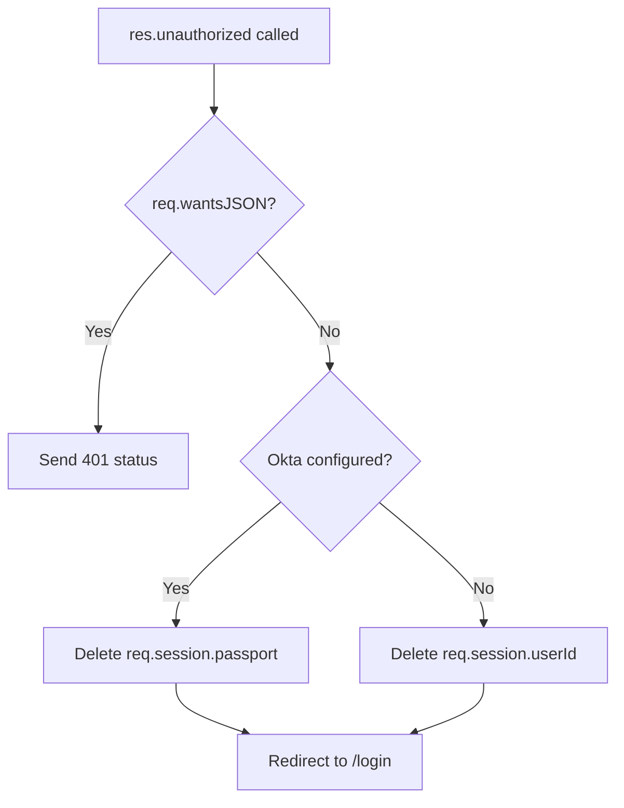

<!-- source-hash: 7ba899d585be345d776afcc616cbef01 -->
A custom Sails.js response handler that content-negotiates unauthorized requests — returning a `401` status for JSON/API clients or clearing the session and redirecting to `/login` for browser clients.

## Key Components

- **`req.wantsJSON`** — Detects whether the request expects a JSON response; if `true`, sends `401 Unauthorized` with no body.
- **Okta session cleanup** — When `sails.config.custom.oktaClientSecret` is configured, clears `req.session.passport` instead of `req.session.userId`.
- **Standard session cleanup** — Deletes `req.session.userId` for non-Okta setups before redirecting.
- **`res.redirect('/login')`** — Redirects browser clients to the login page after session cleanup.

## Usage Example

```javascript
// In a controller action
return res.unauthorized();

// With actions2 exits
exits: {
  badCombo: {
    description: 'That email address and password combination is not recognized.',
    responseType: 'unauthorized'
  }
}
```

## Authentication Flow



**Source:** [`api/responses/unauthorized.js`](https://github.com/flamingo-stack/fleetmdm/blob/main/api/responses/unauthorized.js)