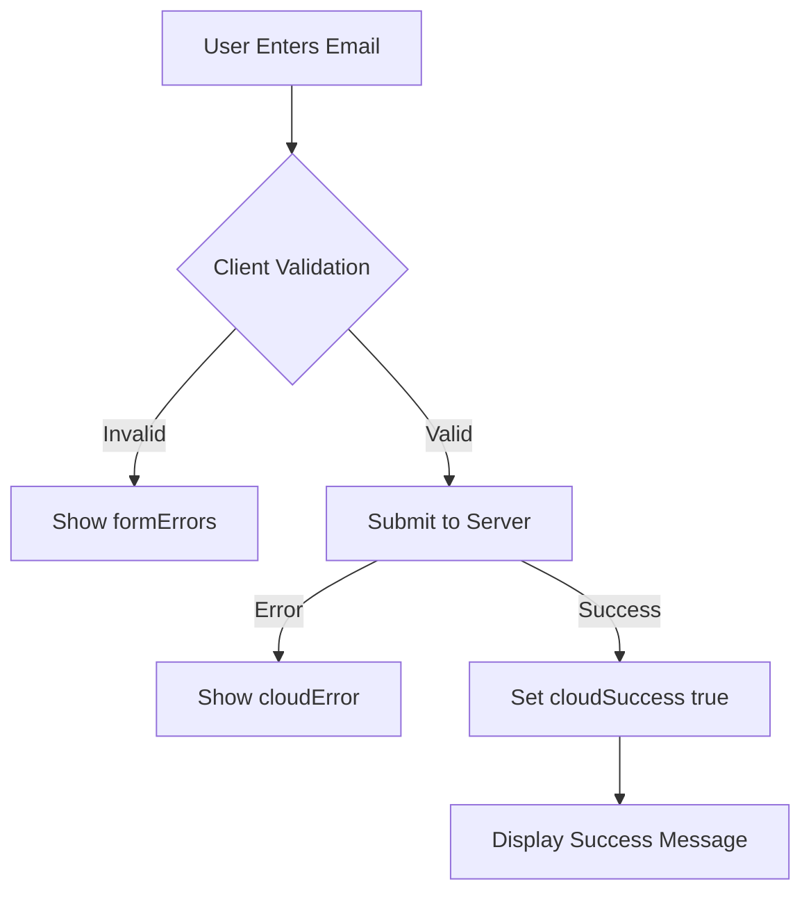

<!-- source-hash: 68452feb76d6aabe07e923b85aa10819 -->
Registers the `forgot-password` parasails page, handling form state, validation, and submission for the password reset request flow.

## Key Components

| Property | Type | Description |
|---|---|---|
| `syncing` | Boolean | Loading/syncing state during form submission |
| `formData` | Object | Holds user-supplied email input |
| `formErrors` | Object | Tracks client-side validation errors per field |
| `formRules` | Object | Validates `emailAddress` as required and properly formatted |
| `cloudError` | String | Stores server-side error messages |
| `cloudSuccess` | Boolean | Toggles success message after successful submission |
| `submittedForm` | Method | Callback triggered on successful form submission |

## Usage Example

```javascript
// Triggered automatically by parasails when the forgot-password page mounts.
// The submittedForm method is called after the form cloud action resolves successfully.

submittedForm: async function() {
  // Flip success state to display confirmation UI
  this.cloudSuccess = true;
}
```

## Behavior Flow



## Notes

- Validation enforces both `required` and `isEmail` on the `emailAddress` field before any server call is made
- `cloudSuccess` replaces the form UI with a confirmation message, preventing duplicate submissions
- Source: [`forgot-password.page.js`](https://github.com/flamingo-stack/fleetmdm/blob/main/forgot-password.page.js)