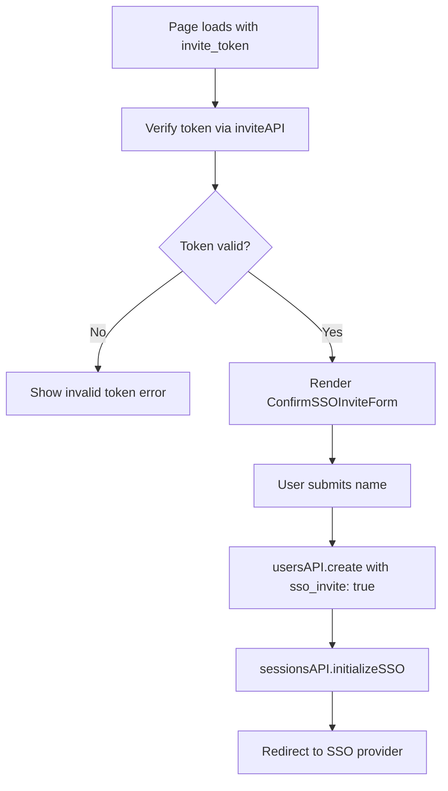

<!-- source-hash: 3f9520f4662777db6517d4af79532f0a -->
Handles the SSO invitation confirmation flow, allowing new users to complete account registration via an invite token before being redirected through SSO authentication.

## Key Components

- **`ConfirmSSOInvitePage`** – Default export; page component that validates an invite token, collects the user's name, creates their account, and initiates an SSO session.
- **`onSubmit`** – Async callback that calls `usersAPI.create` with `sso_invite: true`, then redirects the user via `sessionsAPI.initializeSSO`.
- **`renderContent`** – Renders a `<Spinner />` during validation, an error message for invalid tokens, or the `ConfirmSSOInviteForm` on success.

## Usage Example

```typescript
// Rendered by the router — no manual instantiation needed.
// Route params supply the invite_token:
<Route
  path={paths.CONFIRM_SSO_INVITE}
  component={ConfirmSSOInvitePage}
/>
```

## Behavior Flow



> **Note:** If a `currentUser` session already exists when the page loads, the user is immediately redirected to the dashboard via the `useEffect` guard.

## Source

[`ConfirmSSOInvitePage.tsx`](https://github.com/flamingo-stack/fleetmdm/blob/main/frontend/pages/ConfirmSSOInvitePage.tsx)