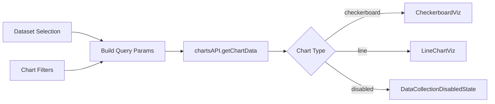

<!-- source-hash: 762b43e334c7090a8358ad9d24ca338c -->
A React component that renders an interactive metrics chart card with dataset selection, filtering, and multiple visualization types for Fleet host monitoring data.

## Key Components

- **`ChartCard`** – Main exported component that orchestrates data fetching, state management, and chart rendering
- **`hasActiveFilters`** – Utility function that checks whether any label, platform, or host filters are currently active
- **`CHART_DAYS`** – Constant (30) defining the fixed historical data window
- **`DATASETS`** – Dynamic dataset registry (base: `uptime`; premium tier adds `cve`) with per-dataset config including labels, themes, tooltip formatters, and chart types
- **`renderChart`** – Internal method that conditionally renders `CheckerboardViz`, `LineChartViz`, `DataCollectionDisabledState`, `Spinner`, or `DataError` based on current state

## Usage Example

```typescript
import ChartCard from "./ChartCard";

// Basic usage (no team scoping)
<ChartCard />

// With team scoping and data-collection feature flags
<ChartCard
  currentTeamId={42}
  historicalDataEnabled={{
    uptime: true,
    cve: false,
  }}
/>
```

## Data Flow



## Notes

- **Premium gating**: The `cve` dataset is only added to `DATASETS` when `isPremiumTier` is `true` via `AppContext`
- **Filter reset**: `chartFilters` is cleared automatically when `currentTeamId` changes to prevent stale label/host IDs across team scopes
- **Query caching**: Chart data is cached for 5 minutes (`staleTime: 300000`) via `react-query`
- **Timezone handling**: Requests include `tz_offset` and fetch `CHART_DAYS + 1` days to ensure complete calendar-day coverage