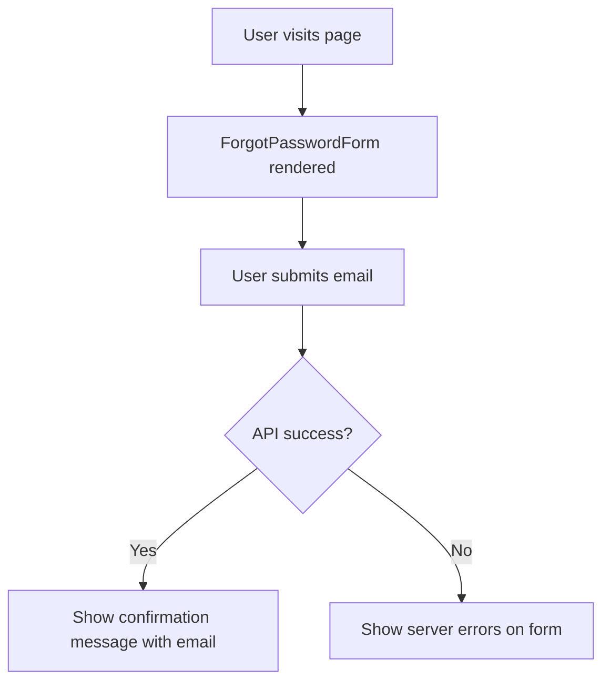

<!-- source-hash: 92d1c1dc37d6bd7b7406ca69abd17650 -->
Renders the forgot password page, handling form submission to trigger a password reset email and displaying a confirmation message upon success.

## Key Components

- **`ForgotPasswordPage`** — Main page component accepting an `InjectedRouter` prop
- **`handleSubmit`** — Async handler that calls `usersAPI.forgotPassword`, manages loading state, and captures errors via `formatErrorResponse`
- **`renderContent`** — Conditionally renders either the `ForgotPasswordForm` or a success confirmation message with a link to the password reset FAQ
- **State**
  - `email` — Stores the submitted email address; when set, triggers the success view
  - `errors` — Tracks server-side validation errors passed to the form
  - `isLoading` — Controls form submission loading state

## Usage Example

```typescript
import ForgotPasswordPage from "pages/ForgotPasswordPage";

// Used as a route-level component; router is injected by React Router
<ForgotPasswordPage router={router} />
```

## Flow



## Notes

- Errors are cleared on mount via `useEffect` and on each input change via `onChangeFunc`
- On success, the confirmation message links to the [FleetDM password reset FAQ](https://fleetdm.com/docs/using-fleet/fleetctl-cli)
- Source: [`https://github.com/flamingo-stack/fleetmdm/blob/main/ForgotPasswordPage.tsx`](https://github.com/flamingo-stack/fleetmdm/blob/main/ForgotPasswordPage.tsx)