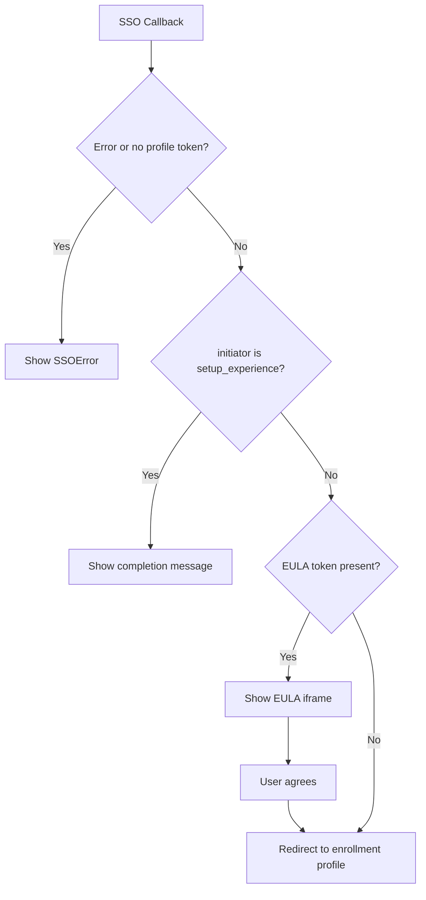

<!-- source-hash: 077019d8e940224b25329033ec517364 -->
Handles the SSO callback flow for Apple MDM enrollment, processing query parameters to route users through EULA acceptance, enrollment profile redirection, or setup experience completion.

## Key Components

- **`MDMAppleSSOCallbackPage`** — Root page component that extracts query parameters (`eula_token`, `profile_token`, `enrollment_reference`, `initiator`, `error`) from the router and passes them to `EnrollmentGate`.
- **`EnrollmentGate`** — Core logic component that determines which step to render based on enrollment state:
  - Shows `SSOError` on missing profile token or explicit error
  - Renders a "close this window" confirmation for `setup_experience` initiator
  - Displays an inline EULA iframe with an "Agree and continue" button when `eulaToken` is present
  - Redirects to the MDM enrollment profile URL otherwise
- **`RedirectTo`** — Thin helper that triggers `window.location.href` navigation and renders a `Spinner` during the redirect.

## Usage Example

This page is typically mounted at the MDM SSO callback route. Example query string handled:

```text
/mdm/sso/callback?profile_token=abc123&eula_token=xyz789&enrollment_reference=ref001&initiator=mdm
```

```typescript
// Router automatically supplies props; no manual instantiation needed.
// EnrollmentGate renders the EULA step first, then redirects to:
endpoints.MDM_APPLE_ENROLLMENT_PROFILE(profileToken, enrollmentReference, deviceinfo)
```

## Flow Summary



**Source:** [`MDMAppleSSOCallbackPage.tsx`](https://github.com/flamingo-stack/fleetmdm/blob/main/MDMAppleSSOCallbackPage.tsx)