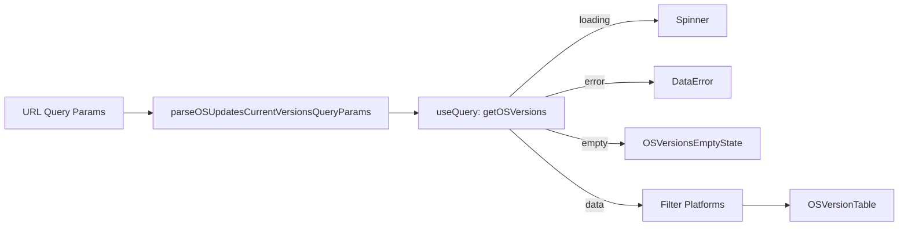

<!-- source-hash: 3a0d2544b23b514c02190f50e309a094 -->
Renders the "Current versions" section of the OS Updates page, fetching and displaying a filtered, paginated table of operating system versions across supported platforms.

## Key Components

### Exports
- **`CurrentVersionSection`** *(default)* — React component that queries OS version data and renders a paginated `OSVersionTable` with loading, error, and empty states
- **`parseOSUpdatesCurrentVersionsQueryParams`** — Utility that normalizes raw URL query params into typed pagination/sort parameters with defaults
- **`IFilteredOperatingSystemVersion`** — Type narrowing `IOperatingSystemVersion["platform"]` to only `OSUpdatesSupportedPlatform` values (`darwin`, `windows`, `ios`, `ipados`)

### Constants
| Constant | Value |
|---|---|
| `DEFAULT_SORT_DIRECTION` | `"desc"` |
| `DEFAULT_SORT_HEADER` | `"hosts_count"` |
| `DEFAULT_PAGE` | `0` |
| `DEFAULT_PAGE_SIZE` | `8` |

## Usage Example

```typescript
import CurrentVersionSection, {
  parseOSUpdatesCurrentVersionsQueryParams,
} from "./CurrentVersionSection";

// Parse query params from URL (e.g., via react-router location.query)
const queryParams = parseOSUpdatesCurrentVersionsQueryParams({
  page: "2",
  order_key: "hosts_count",
  order_direction: "asc",
});

<CurrentVersionSection
  router={router}
  currentTeamId={42}
  queryParams={queryParams}
/>
```

## Platform Filtering

Only the following platforms are rendered in the table; all others are silently excluded:

- `windows`
- `darwin` (macOS)
- `ios`
- `ipados`

## Data Flow



**Source:** [`frontend/pages/SoftwarePage/components/CurrentVersionSection.tsx`](https://github.com/flamingo-stack/fleetmdm/blob/main/frontend/pages/SoftwarePage/components/CurrentVersionSection.tsx)