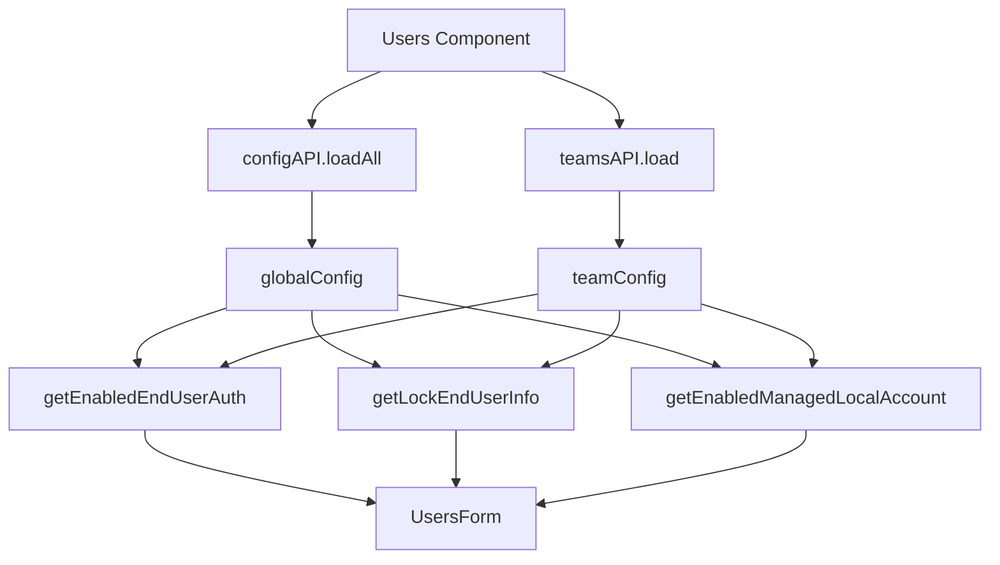

<!-- source-hash: 0c7c4279e82720885e2d1dd71b6d7e84 -->
Renders the "Users" setup experience card for MDM configuration, allowing administrators to customize local user account creation and end-user authentication settings for a given team or global scope.

## Key Components

- **`Users`** — Main React component accepting `currentTeamId` via `ISetupExperienceCardProps`. Fetches global and team-level MDM config, then renders a `UsersForm` with derived defaults.
- **`getEnabledManagedLocalAccount`** — Derives managed local account config (`enabled` flag + `local_account_type`) from global or team config based on `currentTeamId`.
- **`getEnabledEndUserAuth`** — Returns whether end-user authentication is enabled for the current team or globally.
- **`getLockEndUserInfo`** — Returns whether end-user info locking is enabled for the current team or globally.
- **`isIdPConfigured`** — Validates that required IdP fields (`entity_id`, `idp_name`, and `metadata_url` or `metadata`) are present in the MDM config.

## Usage Example

```typescript
import Users from "./Users";

// Used inside the Setup Experience navigation flow
const SetupExperiencePage = () => {
  const currentTeamId = 42; // 0 for "No team" (global)

  return <Users currentTeamId={currentTeamId} />;
};
```

## Data Flow



> **Note:** Team config is only fetched when `currentTeamId !== 0`. A `Spinner` is shown while either config query is loading.