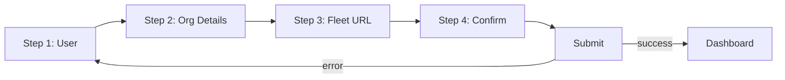

<!-- source-hash: b307f5469e22084e66d690333e8be926 -->
Multi-step Fleet setup wizard that handles initial server configuration, user account creation, and organization setup, redirecting authenticated users to the dashboard.

## Key Components

- **`RegistrationPage`** — Main page component managing a 4-step registration flow with page/progress tracking state
- **`onNextPage`** — Advances the current step while tracking the highest page reached (enables breadcrumb navigation)
- **`onRegistrationFormSubmit`** — Handles full setup sequence: creates user via `usersAPI.setup`, saves auth token, optionally uploads org logo, fetches user context, then redirects to dashboard
- **`onSetPage`** — Allows backward navigation via breadcrumbs but prevents skipping ahead of `pageProgress`
- **`REGISTRATION_HEADERS`** — Maps step numbers to header strings: *Set up user → Organization details → Set Fleet URL → Confirm configuration*
- **`ERROR_NOTIFICATION`** — Static error shown on setup failure, with a hint for proxy-related connectivity issues

## Usage Example

```typescript
// Rendered by the router at the /setup route
import RegistrationPage from "pages/RegistrationPage";

// In route config:
{ path: paths.SETUP, component: RegistrationPage }

// The component self-redirects if a user is already logged in:
// useEffect(() => {
//   if (currentUser) router.push(DASHBOARD);
// }, [currentUser]);
```

## State Flow



## Notes

- Logo upload failures are non-blocking — errors are caught and logged without interrupting registration
- `window.location.reload()` is called post-redirect to ensure app context is fully refreshed
- Source: [`frontend/pages/RegistrationPage/RegistrationPage.tsx`](https://github.com/flamingo-stack/fleetmdm/blob/main/frontend/pages/RegistrationPage/RegistrationPage.tsx)