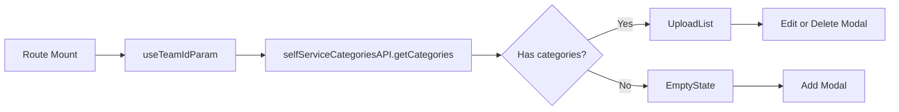

<!-- source-hash: 90af50622d13bfb3b66ce2b88de0b4b3 -->
Renders the Self-Service Categories management page, allowing admins and maintainers to view, add, edit, and delete self-service software categories scoped to a team.

## Key Components

- **`SelfServiceCategoriesPage`** — Default export. Main page component that orchestrates category listing and CRUD modal flows.
- **`renderHeader()`** — Renders the back button, team selector (premium/non-Primo mode), and page description with a learn-more link.
- **`renderBody()`** — Conditionally renders a premium gate, spinner, error state, empty state, or the category list depending on data/auth state.
- **Modal state** — Three independent state variables (`showAddModal`, `categoryToEdit`, `categoryToDelete`) control `AddCategoryModal`, `EditCategoryModal`, and `DeleteCategoryModal`.
- **Deep-link support** — Reads the `add_category=1` query param to auto-open the Add modal (admin/maintainer only), then strips the param from the URL.
- **`canManage`** — Derived boolean combining global admin/maintainer and team admin/maintainer roles to gate all write actions.

## Usage Example

```typescript
// Mounted automatically by the router at the self-service categories route.
// The router injects `router` and `location` props.

<SelfServiceCategoriesPage
  router={injectedRouter}
  location={{
    pathname: "/software/self-service/categories",
    search: "?team_id=3",
    query: { team_id: "3" },
  }}
/>

// To deep-link directly into the Add modal (e.g. from a command palette):
// Navigate to: /software/self-service/categories?team_id=3&add_category=1
// The modal opens automatically if the user has manage permissions,
// then the `add_category` param is stripped from the URL.
```

## Data Flow



**Source:** [`flamingo-stack/fleetmdm`](https://github.com/flamingo-stack/fleetmdm/blob/main/frontend/pages/SoftwarePage/SelfServiceCategoriesPage/SelfServiceCategoriesPage.tsx)