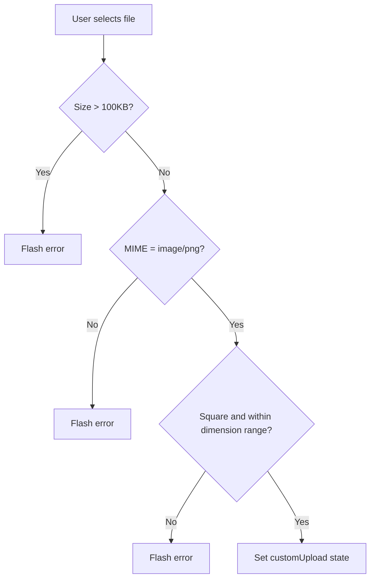

<!-- source-hash: b3e78cadf76359f9b207a41d74b060f7 -->
This modal component manages editing a software title's custom icon and display name within the Fleet MDM software management UI.

## Key Components

### Types & Interfaces

- **`IconStatus`** — Union type (`"customUpload" | "apiCustom" | "fallback"`) representing the current icon source state
- **`IconState`** — Encapsulates all icon preview/upload state: `previewUrl`, `formData`, `dimensions`, `fileDetails`, and `status`
- **`IEditIconModalProps`** — Props including `softwareId`, `teamIdForApi`, `software`, `previewInfo`, icon timestamp helpers, and callbacks
- **`ISoftwareDisplayNameFormData`** — Exported interface for the display name form field

### State & Logic

- **`iconState`** — Tracks current icon across three modes: API-fetched custom, user-uploaded, or fallback/default
- **`canSaveForm`** — Derived boolean enabling the Save button only when icon or display name has actually changed
- **`setCurrentApiCustomIcon`** / **`setCustomUpload`** / **`resetIconState`** — State transition helpers for icon lifecycle
- **`getFilenameFromContentDisposition`** — Parses RFC 5987 and standard `Content-Disposition` headers to extract filenames

### Queries

- **`softwareAPI.getSoftwareIcon`** — Fetches current custom icon blob; keyed by `[softwareId, teamIdForApi, iconUploadedAt]` to force refresh after uploads
- **`selfServiceCategoriesAPI.getCategories`** — Loads self-service categories for preview rendering

### Validation Constants

```typescript
const MIN_DIMENSION = 120;   // px
const MAX_DIMENSION = 1024;  // px
const MAX_FILE_SIZE = 100 * 1024; // 100KB
const ACCEPTED_EXTENSIONS = ".png";
```

## Usage Example

```typescript
<EditIconModal
  softwareId={42}
  teamIdForApi={1}
  software={softwarePackage}
  installerType="package"
  iconUploadedAt={iconTimestamp}
  setIconUploadedAt={(ts) => setIconTimestamp(ts)}
  onExit={() => setShowModal(false)}
  refetchSoftwareTitle={refetch}
  previewInfo={{
    currentIconUrl: "/api/v1/fleet/software/42/icon",
    name: "My App",
    titleName: "My App",
    source: "apps",
  }}
/>
```

## File Validation Flow



**Source:** [`flamingo-stack/fleetmdm`](https://github.com/flamingo-stack/fleetmdm)