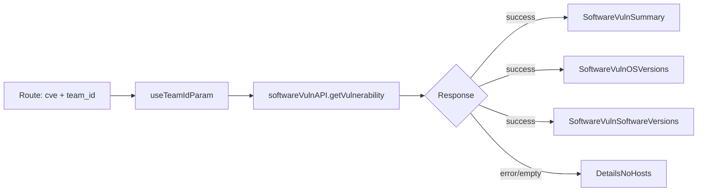

<!-- source-hash: c09e7b9f573677a373eed7a161197692 -->
Renders the detail view for a specific CVE vulnerability at the `software/vulnerabilities/:cve` route, fetching and displaying vulnerability metadata, affected OS versions, and affected software versions scoped to the selected team.

## Key Components

- **`SoftwareVulnerabilityDetailsPage`** — Default export; top-level page component driven by route params (`cve`, `fleet_id`)
- **`useTeamIdParam`** — Resolves team context from URL params, supports all-teams and no-team scopes
- **`useQuery` (react-query)** — Fetches vulnerability data via `softwareVulnAPI.getVulnerability`; 403/404 errors are silently ignored, others bubble to the error boundary
- **`renderCards`** — Conditionally renders `SoftwareVulnSummary`, `SoftwareVulnOSVersions`, and `SoftwareVulnSoftwareVersions` based on response data
- **`renderContent`** — Orchestrates loading state (`Spinner`), team header (premium, non-Primo only), error/empty state (`DetailsNoHosts`), and card rendering

## Usage Example

```typescript
// Route definition (React Router)
<Route
  path="software/vulnerabilities/:cve"
  component={SoftwareVulnerabilityDetailsPage}
/>

// The page resolves CVE from routeParams automatically:
// /software/vulnerabilities/CVE-2024-12345?team_id=2
// → fetches vuln data for CVE-2024-12345, scoped to team 2
```

## Data Flow



**Source:** [`SoftwareVulnerabilityDetailsPage.tsx`](https://github.com/flamingo-stack/fleetmdm/blob/main/SoftwareVulnerabilityDetailsPage.tsx)