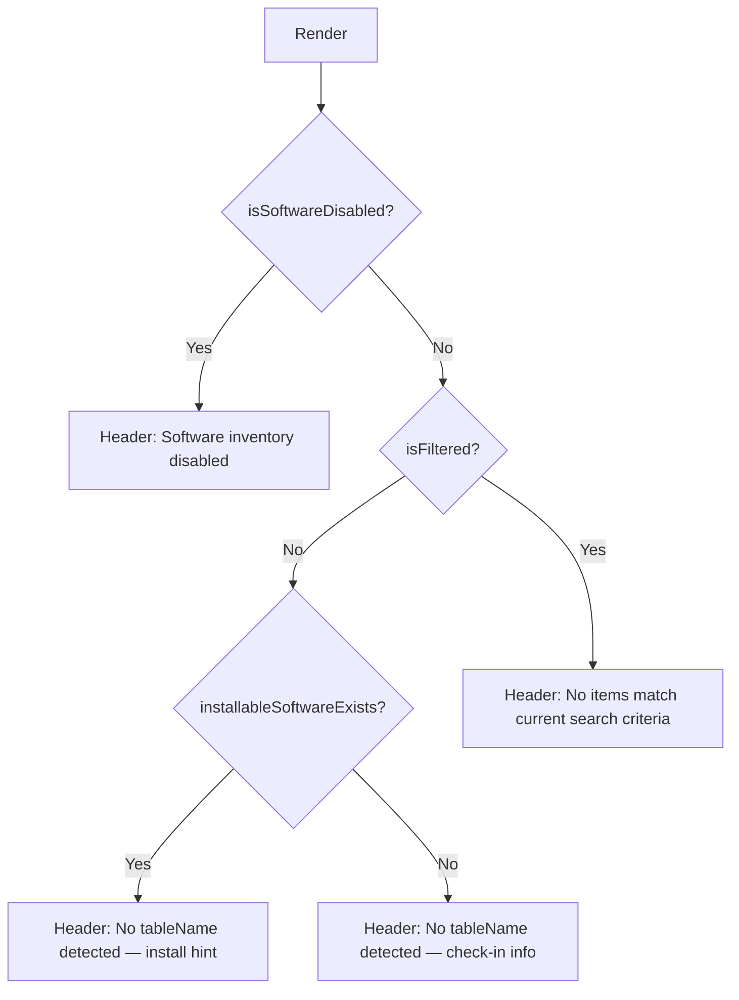

<!-- source-hash: b494a41e907348697863cbd6c58b6123 -->
Renders a contextual empty state for software-related tables, adapting its messaging based on filters, search state, platform, and whether software inventory is enabled.

## Key Components

### `IEmptySoftwareTableProps`
Props interface controlling empty state rendering:

| Prop | Type | Description |
|---|---|---|
| `vulnFilters` | `ISoftwareVulnFiltersParams` | Active vulnerability filters |
| `tableName` | `string` | Table context (`"software"`, `"operating systems"`, `"vulnerabilities"`) |
| `isSoftwareDisabled` | `boolean` | Shows disabled state with admin re-enable link |
| `noSearchQuery` | `boolean` | Whether a search query is active |
| `installableSoftwareExists` | `boolean` | Adjusts messaging when installable software exists |
| `platform` | `HostPlatform` | Appends Android-specific latency notice when applicable |

### `EMPTY_INFO_BY_TABLE`
Static map of table names to default (unfiltered) empty state descriptions. Falls back to the `"software"` entry for unrecognised table names.

### `getFilteredTypeText()`
Returns a human-readable type label for filtered states — returns `"vulnerable software"` when `vulnFilters.vulnerable` is set, otherwise returns the `tableName`.

### `EmptySoftwareTable` (default export)
Derives the appropriate `header` and `info` props via `getEmptyStateProps()` and delegates rendering to the shared `EmptyState` component.

## Usage Example

```typescript
// Unfiltered, no data yet
<EmptySoftwareTable tableName="software" />

// Vulnerability filter active on an Android host
<EmptySoftwareTable
  tableName="software"
  vulnFilters={{ vulnerable: true }}
  noSearchQuery={true}
  platform="android"
/>

// Software inventory turned off
<EmptySoftwareTable isSoftwareDisabled />
```

## Empty State Priority

