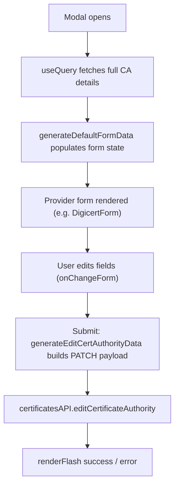

<!-- source-hash: 11fe6c30d0e961a348fe09c767593241 -->
Modal component for editing an existing certificate authority (CA), fetching full CA details and rendering the appropriate provider-specific form based on CA type.

## Key Components

- **`EditCertAuthorityModal`** — Main modal component that orchestrates CA editing
- **`getFormComponent()`** — Selects the correct form component based on `certAuthority.type` (supports `ndes_scep_proxy`, `digicert`, `hydrant`, `smallstep`, `custom_scep_proxy`, `custom_est_proxy`)
- **`renderForm()`** — Handles loading/error states and renders the resolved form component
- **`onChangeForm()`** — Updates form state and marks the form as dirty on user input
- **`onEditCertAuthority()`** — Submits the PATCH request via `certificatesAPI.editCertificateAuthority`, shows success/error flash notifications

## Usage Example

```typescript
import EditCertAuthorityModal from "./EditCertAuthorityModal";
import { ICertificateAuthorityPartial } from "interfaces/certificates";

const certAuthority: ICertificateAuthorityPartial = {
  id: 42,
  type: "digicert",
  name: "My DigiCert CA",
};

<EditCertAuthorityModal
  certAuthority={certAuthority}
  onExit={() => setShowEditModal(false)}
/>
```

## Data Flow



## Notes

- The `@ts-ignore` on `formData` prop indicates a known typing gap across the union of provider-specific form shapes — tracked for future resolution.
- Relies on [`NotificationContext`](https://github.com/flamingo-stack/fleetmdm/blob/main/context/notification) for flash messaging and [`DEFAULT_USE_QUERY_OPTIONS`](https://github.com/flamingo-stack/fleetmdm/blob/main/utilities/constants) for consistent query configuration.