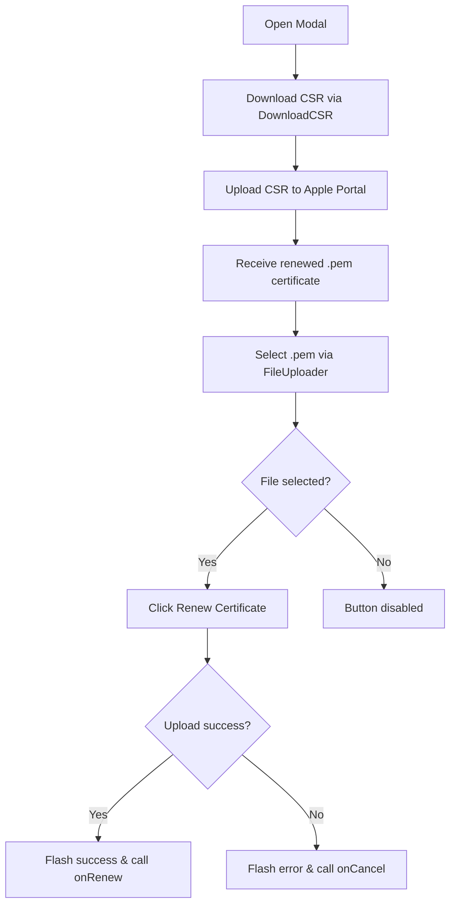

<!-- source-hash: 9ccb1f62724fe89f19fa39ce8bf099b2 -->
A modal component for renewing Apple Push Notification service (APNs) certificates in the Fleet MDM admin interface, handling CSR download, `.pem` file upload, and certificate renewal via the MDM Apple API.

## Key Components

| Export / Symbol | Description |
|---|---|
| `RenewCertModal` (default export) | Modal React component that orchestrates the APNs certificate renewal flow |
| `IRenewCertModalProps` | Props interface with `onCancel` and `onRenew` callbacks |
| `onSelectFile` | Callback to capture the selected `.pem` file from the file picker |
| `onRenewClick` | Async handler that uploads the certificate via `mdmAppleApi.uploadApplePushCertificate` |
| `onDownloadError` | Error handler for CSR download failures with contextual flash messages |

## Usage Example

```typescript
import RenewCertModal from "./RenewCertModal";

const ManageCertificates = () => {
  const [showRenewModal, setShowRenewModal] = useState(false);

  return (
    <>
      {showRenewModal && (
        <RenewCertModal
          onCancel={() => setShowRenewModal(false)}
          onRenew={() => {
            setShowRenewModal(false);
            // Refresh certificate status after renewal
            refetchCertStatus();
          }}
        />
      )}
    </>
  );
};
```

## Renewal Flow



## Error Handling

The component surfaces three distinct error states during CSR download:

- **APNS permission error** — renders the raw API error message
- **Missing private key** — includes a `Learn how` link to Fleet server private key docs
- **Generic failure** — displays a fallback retry message

Source: [`flamingo-stack/fleetmdm`](https://github.com/flamingo-stack/fleetmdm/blob/main/components/RenewCertModal.tsx)