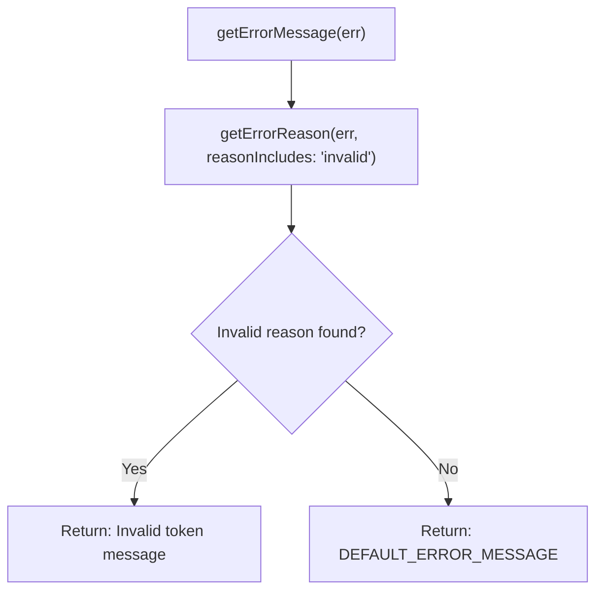

<!-- source-hash: 381d2f8aeb52bdcc582b6f519c90c77b -->
Utility helper for parsing and formatting ABM (Apple Business Manager) token renewal error messages.

## Key Components

### `getErrorMessage(err: unknown): string`
Parses an unknown error and returns a user-friendly message. Checks if the error contains an `"invalid"` reason via `getErrorReason` and returns a specific invalid token message; otherwise falls back to the default renewal error message.

**Constants:**
- `DEFAULT_ERROR_MESSAGE` — Fallback message: `"Couldn't renew. Please try again."`

## Usage Example

```typescript
import { getErrorMessage } from "./helpers";

try {
  await renewAbmToken(token);
} catch (err) {
  const message = getErrorMessage(err);
  // "Invalid token. Please provide a valid token from Apple Business."
  // or "Couldn't renew. Please try again."
  showErrorToast(message);
}
```

## Error Resolution Logic



## Source

[`helpers.ts`](https://github.com/flamingo-stack/fleetmdm/blob/main/helpers.ts)