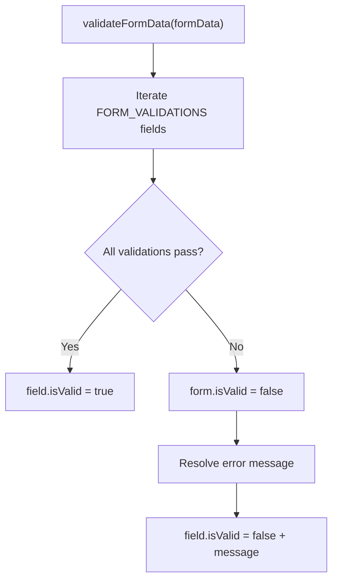

<!-- source-hash: 5bc666788907b36d7cf6daf8b2dc5135 -->
Validation helper for the Add Entra Tenant modal form, providing field-level validation rules and a unified form validation function for Microsoft Entra tenant ID input.

## Key Components

- **`IAddTenantFormValidation`** — Interface describing the validation result shape, including a top-level `isValid` flag and optional per-field validation state with error messages.
- **`FORM_VALIDATIONS`** — Internal constant defining validation rules for the `tenantId` field:
  - `required` — Ensures the field is non-empty.
  - `validUUID` — Confirms the value matches UUID format (skipped if empty, deferring to `required`).
- **`getErrorMessage`** — Internal helper that resolves a validation message, supporting both static strings and dynamic message functions receiving form data.
- **`validateFormData`** — Primary export. Iterates all field validations, returning a full `IAddTenantFormValidation` result with per-field pass/fail state and error messages.

## Usage Example

```typescript
import { validateFormData } from "./helpers";

const formData = { tenantId: "not-a-uuid" };
const result = validateFormData(formData);

if (!result.isValid) {
  console.log(result.tenantId?.message);
  // "Invalid UUID. Please provide a valid UUID format."
}

const validData = { tenantId: "550e8400-e29b-41d4-a716-446655440000" };
const validResult = validateFormData(validData);
console.log(validResult.isValid); // true
```

## Validation Flow

