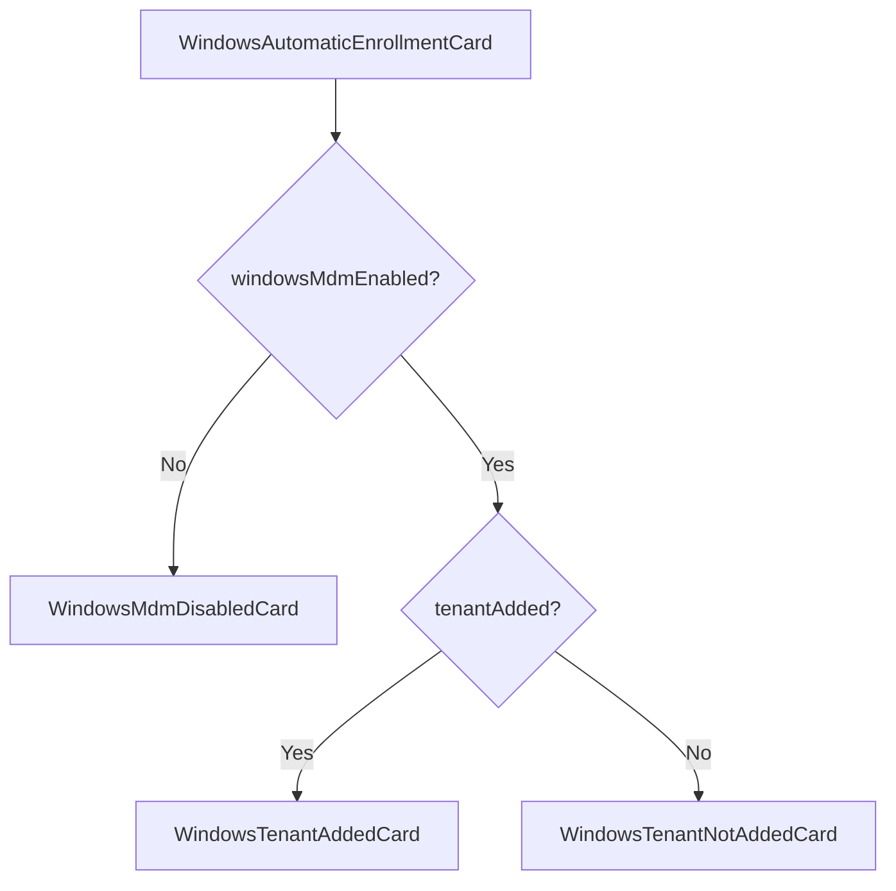

<!-- source-hash: 093190ae19a21a76a8e0e426d22b53b9 -->
Renders a contextual enrollment status card for Windows MDM (Microsoft Entra/Autopilot) integration, displaying one of three states based on MDM enablement and tenant configuration.

## Key Components

### Interfaces

| Interface | Props | Description |
|-----------|-------|-------------|
| `IWindowsAutomaticEnrollmentCardProps` | `windowsMdmEnabled`, `tenantAdded`, `viewDetails` | Props for the main exported component |
| `IWindowsTenantAddedCardProps` | `editTenants` | Props for the tenant-added state card |
| `IWindowsTenantNotAddedCardProps` | `addTenant` | Props for the tenant-not-added state card |

### Internal Components

- **`WindowsMdmDisabledCard`** — Static card prompting the user to enable Windows MDM before enrollment is possible.
- **`WindowsTenantAddedCard`** — Displays a success state with an **Edit** button to modify the connected Entra tenant.
- **`WindowsTenantNotAddedCard`** — Displays a **Connect** CTA prompting the user to add their Microsoft Entra tenant ID.

### Default Export

- **`WindowsAutomaticEnrollmentCard`** — Orchestrates which card to render using the following priority:
  1. MDM disabled → `WindowsMdmDisabledCard`
  2. Tenant added → `WindowsTenantAddedCard`
  3. Tenant not added → `WindowsTenantNotAddedCard`

## Usage Example

```typescript
<WindowsAutomaticEnrollmentCard
  windowsMdmEnabled={true}
  tenantAdded={false}
  viewDetails={() => openTenantModal()}
/>
```

## State Flow



> **Source:** [`flamingo-stack/fleetmdm`](https://github.com/flamingo-stack/fleetmdm/blob/main/WindowsEnrollmentCard.tsx)