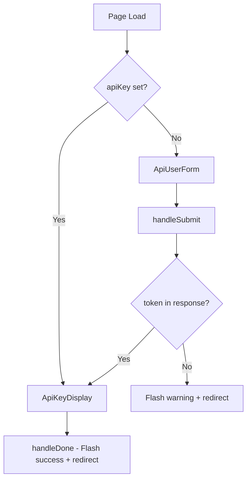

<!-- source-hash: 0cfdaf7ec74a5af71d44025c563c98b2 -->
Page component for creating API-only users, managing form submission, API key generation, and post-creation display flow.

## Key Components

| Export | Type | Description |
|--------|------|-------------|
| `CreateApiUserPage` | React Component (default) | Full-page form for creating API-only Fleet users |
| `ICreateApiUserPageProps` | Interface | Props shape requiring an `InjectedRouter` instance |

### Internal State

| State | Type | Purpose |
|-------|------|---------|
| `isSubmitting` | `boolean` | Tracks form submission in-progress state |
| `apiKey` | `string \| null` | Stores the generated API token post-creation |
| `createdUserName` | `string` | Retains the new user's name for success messaging |

## Render Flow



## Usage Example

```typescript
// Rendered via React Router — no direct instantiation needed
import CreateApiUserPage from "pages/admin/UserManagementPage/CreateApiUserPage";

// Router config (example)
{
  path: PATHS.ADMIN_USERS_CREATE_API_USER,
  component: CreateApiUserPage,
}
```

## Key Behaviors

- **Teams query**: Only fetched when `isPremiumTier` is `true` (gated via `react-query`'s `enabled` flag)
- **API key display**: After successful creation, the page switches from the form to `ApiKeyDisplay` — the only moment the token is shown
- **Error handling**: API failures trigger a flash notification; missing tokens redirect to the users list with a warning
- **Navigation**: Back button and cancel both route to `PATHS.ADMIN_USERS`

## Source

[`CreateApiUserPage.tsx`](https://github.com/flamingo-stack/fleetmdm/blob/main/pages/admin/UserManagementPage/CreateApiUserPage.tsx)