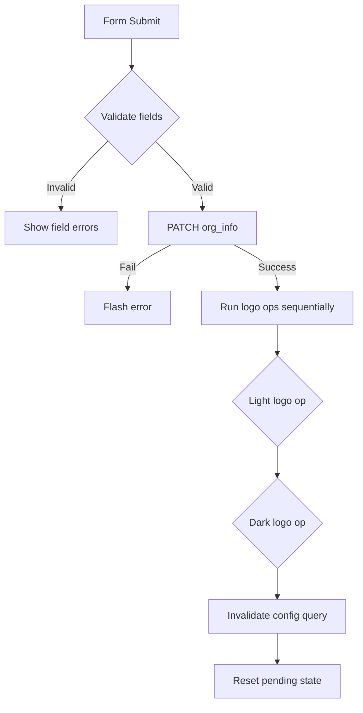

<!-- source-hash: 251b93620d6ed6325b5381bd6f133a85 -->
Renders the Organization Info settings section within the Fleet admin app config, handling org name, support URL, and light/dark mode logo management (upload, preview, and delete).

## Key Components

### `LogoCard` (internal component)
Displays a logo preview card with edit/delete actions for a given mode (`light` | `dark`). Integrates `GitOpsModeTooltipWrapper` to disable controls when GitOps mode is active.

### `Info` (default export)
Main form component managing:
- **Org name & support URL** — validated before submission
- **Light/dark logo state** — tracks pending uploads and deletes via `ILogoModeState`
- **Sequential logo API calls** — uploads/deletes run in series to avoid AppConfig race conditions on the backend
- **Blob URL cleanup** — revokes object URLs on unmount and on logo replacement

## Key Interfaces

| Interface | Purpose |
|---|---|
| `IOrgInfoFormData` | Holds `orgName` and `orgSupportURL` field values |
| `IOrgInfoFormErrors` | Validation error strings keyed by field |
| `ILogoModeState` | Tracks `pendingUpload` (file + blob URL) and `pendingDelete` per logo mode |

## Usage Example

```typescript
// Used inside the admin app config page
import Info from "./Info";

<Info
  appConfig={appConfig}
  handleSubmit={async (data) => {
    await updateAppConfig(data);
    return true;
  }}
  isUpdatingSettings={isUpdatingSettings}
/>
```

## Submit Flow



## Source

[`Info.tsx` on GitHub](https://github.com/flamingo-stack/fleetmdm/blob/main/Info.tsx)