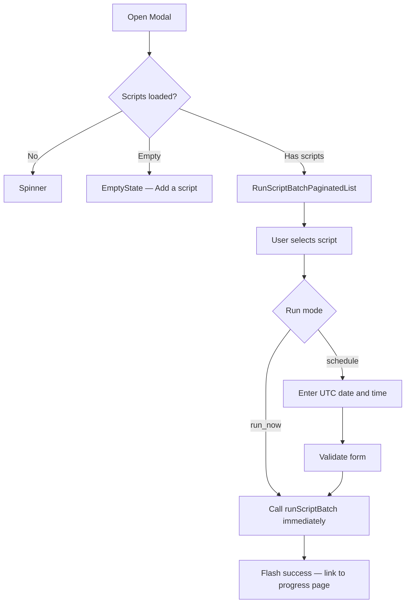

<!-- source-hash: 4e9fd793004357d8fc1855a91d1b0752 -->
A multi-step modal component for running or scheduling a script across multiple hosts in batch — either by applying host filters or targeting specific host IDs.

## Key Components

| Export / Symbol | Description |
|---|---|
| `RunScriptBatchModal` | Default export — the modal component managing script selection, run mode, and batch execution |
| `IRunScriptBatchModal` | Props interface defining filters, team context, host targeting, and cancel callback |
| `IRunScriptBatchModalScheduleFormData` | Shape for schedule form data (`date` and `time` strings) |
| `renderModalContent()` | Internal renderer handling loading, empty, script-selection, and schedule-configuration states |
| `onRunScriptBatch()` | Async handler that builds the request payload and calls `scriptsAPI.runScriptBatch` |
| `onChangeRunMode()` | Switches between `run_now` and `schedule` modes with live form re-validation |
| `onInputChange()` | Updates date/time state and re-validates on each keystroke |

## Usage Example

```typescript
<RunScriptBatchModal
  runByFilters={true}
  filters={{ platform: "darwin" }}
  teamId={3}
  isFreeTier={false}
  totalFilteredHostsCount={120}
  selectedHostIds={[]}
  onCancel={() => setModalOpen(false)}
/>
```

### Flow



## Notes

- Scheduling sets `not_before` as an ISO 8601 UTC timestamp built from the date and time inputs.
- A live UTC clock updates every second via `setInterval` and is surfaced as a tooltip on the time field.
- The "too many hosts" API error is caught and surfaced with a specific user-facing message.
- Script details are displayed via `ScriptDetailsModal` without closing the batch modal (handled via `hide-main` CSS class toggle).