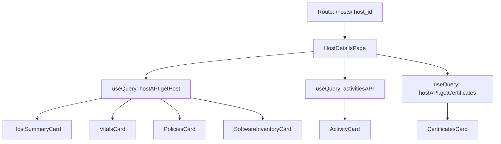

<!-- source-hash: 8383544390f698bd36773a185acb454c -->
Renders the full host details page for Fleet MDM, orchestrating data fetching, state management, and rendering of all host-related tabs, cards, and modals.

## Key Components

### Component
- **`HostDetailsPage`** — Main page component that renders host summary, vitals, software, policies, activity, certificates, and more via tabbed navigation

### State Groups
- **Modal visibility state** — Controls ~20+ modals (delete, transfer, lock, wipe, MDM unenroll, disk encryption, script execution, etc.)
- **Activity state** — `activeActivityTab`, `activityPage`, `showMDMCommands`
- **Certificate state** — `selectedCertificate`, pagination params
- **Detail modals** — `packageInstallDetails`, `scriptPackageDetails`, `activityVPPInstallDetails`, `certificateInstallDetails`, `mdmCommandDetails`, etc.

### Key Interfaces
- **`IHostDetailsProps`** — `router`, `location` (with query params), `params` (host ID)
- **`IHostDetailsSubNavItem`** — Tab navigation item shape
- **`ISearchQueryData`** — Software/user search state

### Constants
- `REFETCH_HOST_DETAILS_POLLING_INTERVAL` — 2000ms polling for host refetch
- `DEFAULT_ACTIVITY_PAGE_SIZE` — 8
- `DEFAULT_CERTIFICATES_PAGE_SIZE` — 10

## Usage Example

```typescript
// Rendered by the Fleet router — not instantiated directly.
// Route: /hosts/:host_id

// Accessed via:
router.push(PATHS.HOST_DETAILS(hostId));

// Query param to open MDM status modal on load:
router.push(getPathWithQueryParams(PATHS.HOST_DETAILS(hostId), {
  show_mdm_status: "true",
}));
```

## Data Flow



## Notes

- Conditionally renders platform-specific cards (macOS, Android, Windows, Linux) based on host OS
- MDM status modal auto-opens when `?show_mdm_status=true` query param is present, and syncs with browser navigation via `useEffect`
- Source: [`pages/hosts/details/HostDetailsPage.tsx`](https://github.com/flamingo-stack/fleetmdm/blob/main/pages/hosts/details/HostDetailsPage.tsx)