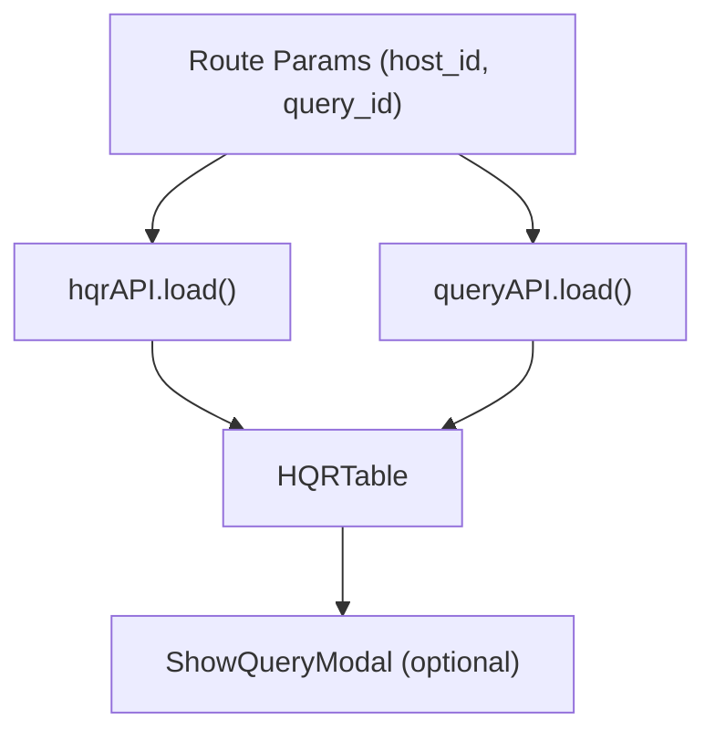

<!-- source-hash: 1b21143349614bc83933de3ec1177ec6 -->
Renders the query report for a specific host, fetching both the host query report (HQR) data and the associated query metadata, then displaying results in a table with navigation controls.

## Key Components

| Export/Symbol | Type | Description |
|---|---|---|
| `HostQueryReport` | Default export (React component) | Main page component for viewing a host's query report |
| `IHostQueryReportProps` | Interface | Props type requiring `router` and `params` (`host_id`, `query_id`) |
| `HQRHeader` | Internal component | Memoized header with back navigation and "View data for all hosts" button |

## Key Behaviors

- **Global redirect**: Redirects to host reports if `query_reports_disabled` is set in server config
- **Discard data redirect**: Redirects if the query has `discard_data` enabled
- **Dynamic document title**: Sets browser tab title to `{queryName} ({hostName}) | Hosts | Fleet`
- **Result normalization**: Flattens `results[].columns` from the HQR API response into flat `rows` for the table

## Usage Example

```typescript
// Rendered via React Router — params injected automatically
<Route
  path={PATHS.HOST_QUERY_REPORT}
  component={HostQueryReport}
/>

// Navigating to this page programmatically
router.push(PATHS.HOST_QUERY_REPORT(hostId, queryId));
```

## Data Flow



## Source

[`HostQueryReport.tsx`](https://github.com/flamingo-stack/fleetmdm/blob/main/frontend/pages/hosts/details/HostQueryReport/HostQueryReport.tsx)