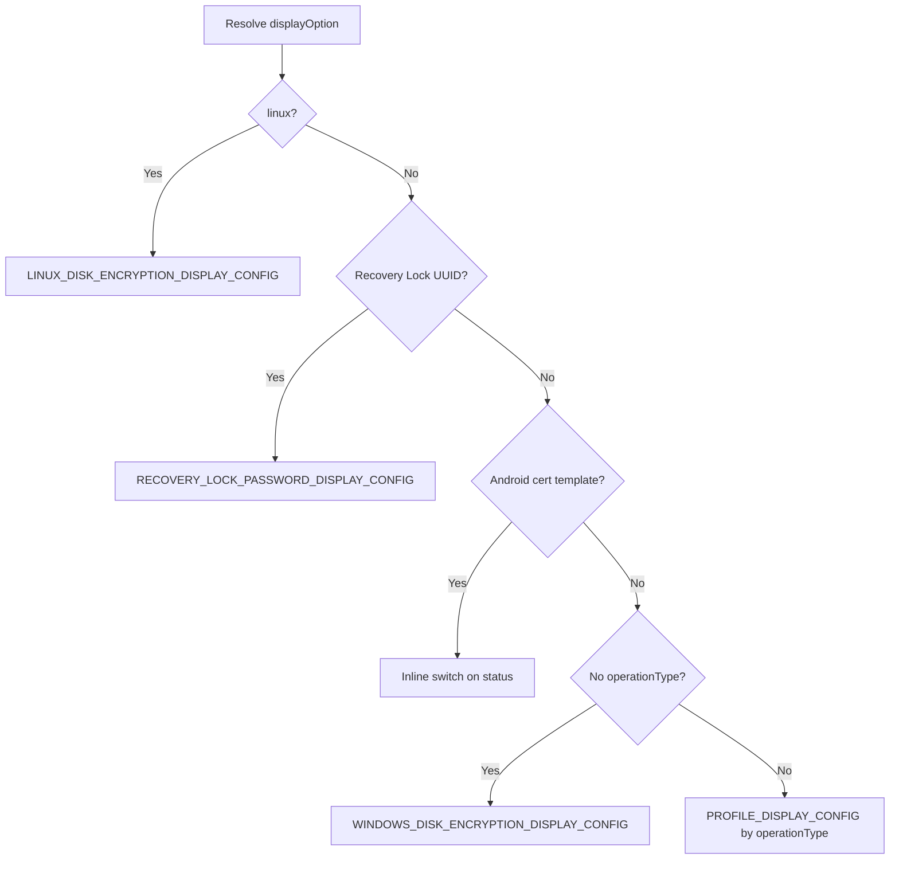

<!-- source-hash: 32e707929ef59e55ee21d8a572218d1b -->
Renders a status cell for OS/MDM profile settings in a host details table, displaying an icon, status text, and contextual tooltip based on the profile type, platform, and current operation state.

## Key Components

### `OSSettingStatusCell` (default export)
A React component that maps MDM profile status values to visual display options and renders them with appropriate icons and tooltips.

**Props (`IOSSettingStatusCellProps`):**

| Prop | Type | Description |
|---|---|---|
| `status` | `OsSettingsTableStatusValue` | Current setting status (e.g. `"pending"`, `"verified"`, `"failed"`) |
| `operationType` | `ProfileOperationType \| null` | Install or remove operation type |
| `profileName` | `string` | Display name of the MDM profile |
| `hostPlatform` | `ProfilePlatform` | Target platform (`"linux"`, `"android"`, `"windows"`, etc.) |
| `profileUUID` | `string` | Profile identifier, used for special-case routing |
| `profile` | `IHostMdmProfileWithAddedStatus` | Full profile object for error/detail tooltip extraction |

### Display Configuration Resolution

The component resolves a `ProfileDisplayOption` by checking platform/profile-specific conditions in priority order:



### Tooltip Priority

1. **Pending detail** — backend-provided `profile.detail` for pending profiles (e.g. Android Wi-Fi awaiting certificate)
2. **Status tooltip** — generic tooltip from `displayOption`, with different props for `action_required` vs. other statuses
3. **Error tooltip** — generated via `generateErrorTooltip(profile)` for failed profiles
4. **No tooltip** — status text rendered without a wrapper

## Usage Example

```typescript
<OSSettingStatusCell
  status="failed"
  operationType="install"
  profileName="Wi-Fi Configuration"
  hostPlatform="darwin"
  profileUUID="abc-123"
  profile={hostMdmProfile}
/>
```

Falls back to `<TextCell value="Unrecognized" />` if no matching display configuration is found.