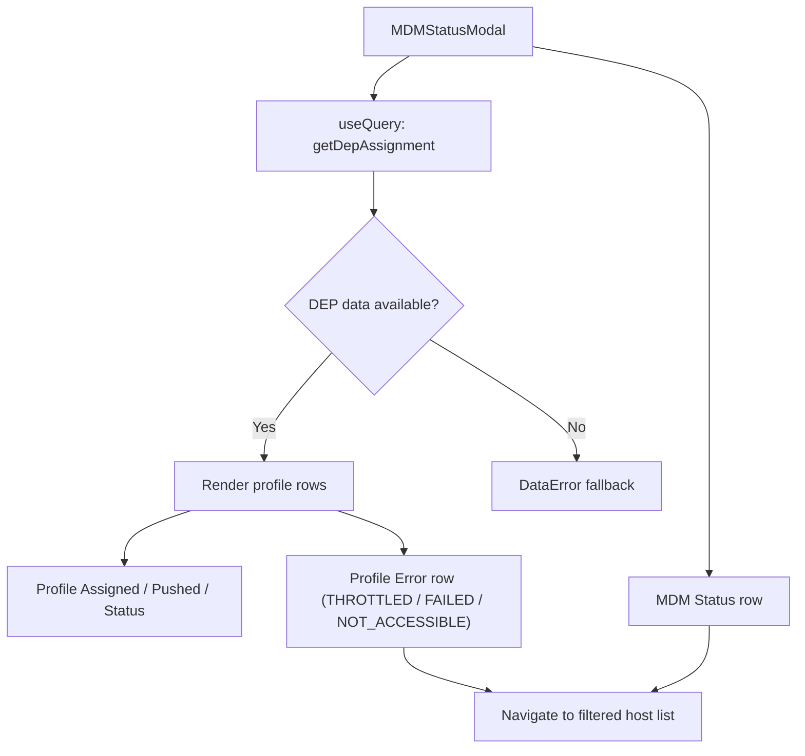

<!-- source-hash: ad1638d4dc76651211eaca6b7c4a3e07 -->
Renders a modal displaying MDM enrollment status and DEP (Device Enrollment Program) profile assignment details for a specific host, including throttle-aware retry messaging and navigation to filtered host lists.

## Key Components

### `MDMStatusModal` (default export)
Main modal component that fetches and displays:
- **MDM enrollment status** — clickable row linking to filtered host list
- **DEP profile assignment data** — profile assigned time, push time, status, and assignment errors (THROTTLED, FAILED, NOT_ACCESSIBLE)

### `getThrottleCopy(responseUpdatedAt?)`
Exported utility that computes a human-readable retry window (e.g., `"in 3 hours"`, `"in <1 hour"`, `"when available."`) based on a 24-hour cooldown from the last Apple API response timestamp.

### `getProfileStatusUI(raw?)`
Maps raw Apple-reported profile status strings (`"empty"`, `"removed"`, `"assigned"`, `"pushed"`) to display labels and tooltips. Falls back to `DEFAULT_EMPTY_CELL_VALUE` for unknown values.

### `PROFILE_STATUS_UI_MAP`
Record mapping `ProfileStatusCode` variants to `{ label, tooltip }` UI descriptors.

## Usage Example

```typescript
import MDMStatusModal from "components/MDMStatusModal";
import { getThrottleCopy } from "components/MDMStatusModal";

// Render the modal
<MDMStatusModal
  hostId={42}
  fleetId={7}
  enrollmentStatus="On (automatic)"
  depProfileError={false}
  isPremiumTier={true}
  isAppleDevice={true}
  router={router}
  onExit={() => setShowModal(false)}
/>

// Compute retry copy for throttled DEP response
const copy = getThrottleCopy("2026-03-25T20:15:19Z");
// → "in 3 hours" (if 21 hours have elapsed since the timestamp)
```

## Data Flow



## Props

| Prop | Type | Description |
|---|---|---|
| `hostId` | `number` | Target host ID for DEP assignment lookup |
| `fleetId` | `number?` | Optional fleet filter for host navigation |
| `enrollmentStatus` | `MdmEnrollmentStatus` | Current MDM enrollment state |
| `depProfileError` | `boolean` | Whether a DEP profile assignment error exists |
| `isPremiumTier` | `boolean` | Enables premium-only features |
| `isAppleDevice` | `boolean` | Controls Apple-specific UI sections |
| `router` | `InjectedRouter` | React Router instance for programmatic navigation |
| `onExit` | `() => void` | Callback to close the modal |