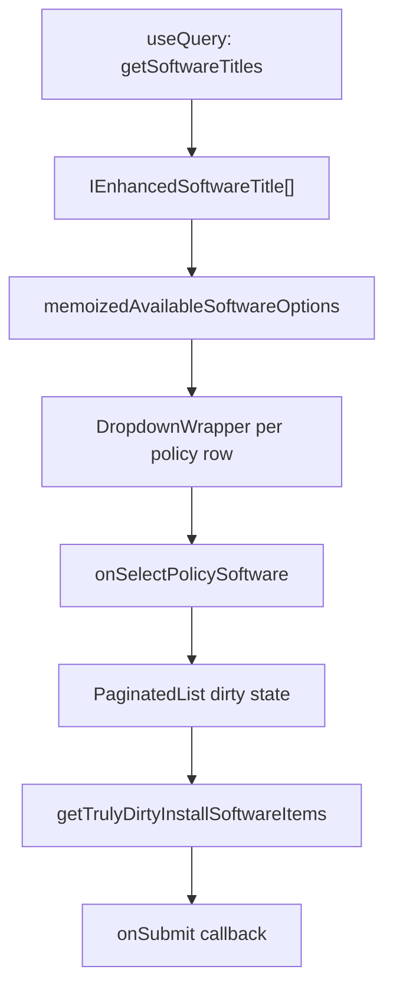

<!-- source-hash: 62d8ea4414ad1e71ef0ca55012dbe6ac -->
Modal component for configuring automatic software installation on policy failure, allowing users to map Fleet policies to installable software titles per team.

## Key Components

### Interfaces & Types
- **`IInstallSoftwareModal`** — Props interface accepting `onExit`, `onSubmit`, `isUpdating`, and `teamId`
- **`IInstallSoftwareFormData`** — Type alias for `IFormPolicy[]`, representing the form submission payload
- **`IEnhancedSoftwareTitle`** — Extends `ISoftwareTitle` with resolved `platform` and `extension` fields

### Exported Utilities
- **`getOriginalSoftwareState(policy)`** — Extracts the original software ID and enabled state from a policy's API-loaded data
- **`getCurrentSoftwareState(policy)`** — Returns the current UI-driven enabled state and selected software ID
- **`getTrulyDirtyInstallSoftwareItems(dirtyItems)`** — Filters form policies to only those with meaningful changes (toggled on/off or software swapped)

### Internal Helpers
- **`formatSoftwarePlatform(source)`** — Converts an `InstallableSoftwareSource` to a `Platform` using the conversion map
- **`generateSoftwareOptionHelpText(title)`** — Builds display strings like `"macOS (.pkg) • 1.2.3"` for dropdown options
- **`availableSoftwareOptions(policy)`** — Filters software titles to those compatible with the policy's platform(s)
- **`memoizedAvailableSoftwareOptions`** — Platform-keyed cache (via `useMemo` + `Map`) for dropdown option lists

## Usage Example

```typescript
<InstallSoftwareModal
  teamId={42}
  isUpdating={isSaving}
  onExit={() => setShowModal(false)}
  onSubmit={(formData) => {
    // formData: IFormPolicy[] — only truly changed items
    updatePolicySoftware(formData);
  }}
/>
```

## Data Flow



**Source:** [`flamingo-stack/fleetmdm`](https://github.com/flamingo-stack/fleetmdm/blob/main/InstallSoftwareModal.tsx)