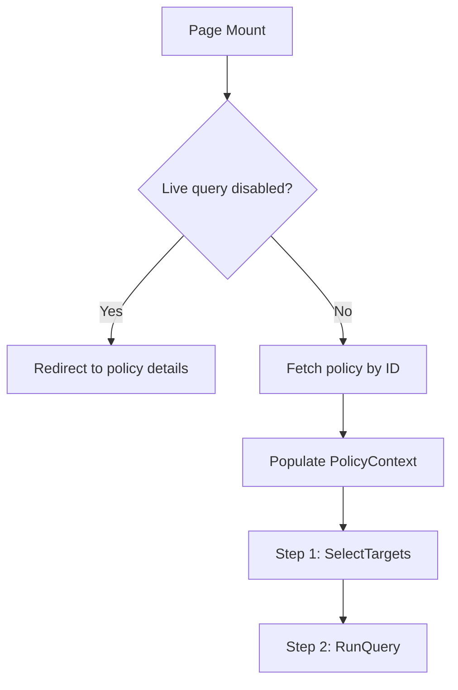

<!-- source-hash: ff018dfcaa53aa501222e90f91af5908 -->
Orchestrates the live policy execution flow, managing a two-step wizard (target selection → query execution) for running Fleet policies against selected hosts in real time.

## Key Components

### `LivePolicyPage` (default export)
The main page component that handles:
- **Policy loading** — Fetches policy details via `policiesAPI.load()` and populates `PolicyContext` with all editable fields
- **Host pre-selection** — Reads `host_ids` from URL query params and auto-adds the host as a target on mount
- **Live query guard** — Redirects to policy details or the manage policies page when live queries are globally disabled
- **Step routing** — Switches between `SelectTargets` (step 1) and `RunQuery` (step 2) screens
- **Document title** — Updates the browser tab title dynamically based on the loaded policy name

### Props (`ILivePolicyPageProps`)
| Prop | Type | Description |
|------|------|-------------|
| `router` | `InjectedRouter` | React Router instance for programmatic navigation |
| `params.id` | `string` | Policy ID from the URL path |
| `location` | `object` | URL location including `host_ids` and `fleet_id` query params |

## Usage Example

```typescript
// Rendered by React Router — not instantiated directly.
// Route definition (react-router v3 style):
<Route
  path={PATHS.LIVE_POLICY(":id")}
  component={LivePolicyPage}
/>

// Navigating to the live policy page programmatically:
router.push(
  getPathWithQueryParams(PATHS.LIVE_POLICY(policyId), {
    fleet_id: currentTeamId,
    host_ids: preSelectedHostId, // optional: pre-fills target
  })
);
```

## Flow



**Source:** [`pages/policies/live/LivePolicyPage.tsx`](https://github.com/flamingo-stack/fleetmdm/blob/main/pages/policies/live/LivePolicyPage.tsx)