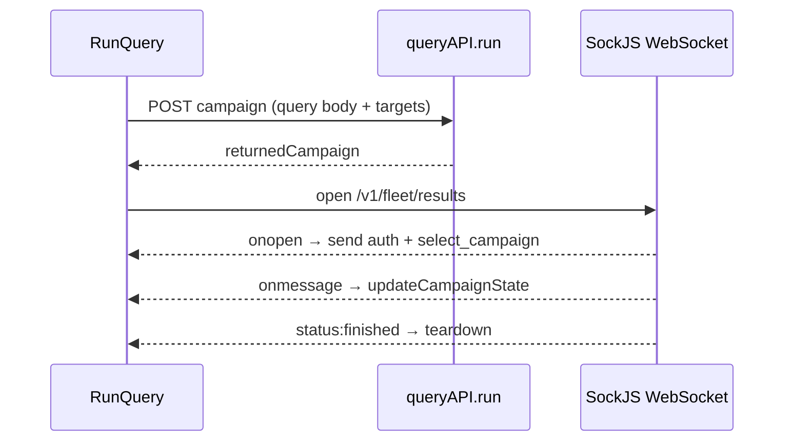

<!-- source-hash: d2ea180d47592f00af60967434e89e88 -->
React component that manages the lifecycle of a live policy query campaign — establishing a WebSocket connection, streaming results, and handling teardown.

## Key Components

| Export/Symbol | Type | Description |
|---|---|---|
| `RunQuery` | `React.FC` | Default export; orchestrates query execution via WebSocket |
| `IRunQueryProps` | `interface` | Props: `storedPolicy`, `selectedTargets`, `goToQueryEditor`, `targetsTotalCount` |
| `connectAndRunLiveQuery` | `function` | Opens a SockJS WebSocket, authenticates, and streams campaign results |
| `onRunQuery` | `function` | Debounced handler that creates a campaign via `queryAPI.run` and connects the socket |
| `onStopQuery` | `function` | Button handler that calls `teardownDistributedQuery` |
| `teardownDistributedQuery` | `function` | Clears the polling interval, resets running state, closes the socket |
| `setupDistributedQuery` | `function` | Stores the socket ref and starts a 1-second elapsed-time interval |

## Usage Example

```typescript
import RunQuery from "pages/policies/edit/components/RunQuery";

<RunQuery
  storedPolicy={policy}
  selectedTargets={targets}
  setSelectedTargets={setTargets}
  goToQueryEditor={() => setActiveTab("editor")}
  targetsTotalCount={targets.length}
/>
```

## Data Flow



## Notes

- Query always runs against `lastEditedQueryBody` from `PolicyContext`; the stored query ID is intentionally set to `null`.
- Duplicate socket messages are deduplicated by comparing raw data strings via `previousSocketData` ref before parsing JSON.
- The component auto-runs `onRunQuery` on mount via `useEffect`.