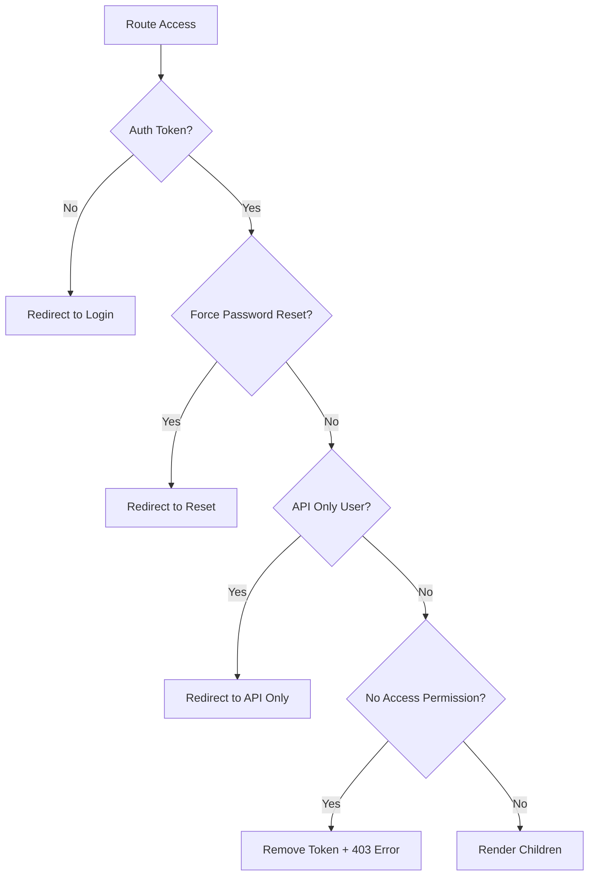

<!-- source-hash: c373e45d8ed86ac5cc1dd0511314822e -->
A route guard component that protects authenticated routes by verifying auth tokens, enforcing redirects, initializing Pendo analytics (sandbox mode), and handling scroll behavior on navigation.

## Key Components

| Export | Type | Description |
|---|---|---|
| `AuthenticatedRoutes` | React Component | Primary route wrapper enforcing authentication and authorization |
| `IAppProps` | Interface | Props shape: `children`, `location` (with `hash`), and `router` |

**Internal behaviors:**

- **`redirectToLogin`** — Saves current path to `RoutingContext` then pushes to `/login`
- **`redirectToPasswordReset`** — Pushes to `/reset_password` when `force_password_reset` is set
- **`redirectToApiUserOnly`** — Pushes to `/api_only_user` for API-only accounts
- **Pendo initialization** — Runs once in sandbox mode when `currentUser` and `config` are available
- **Hash scroll** — Smoothly scrolls to anchor elements on location hash changes

## Auth Guard Logic



## Usage Example

```typescript
// Wrap protected routes in react-router config
import AuthenticatedRoutes from "components/AuthenticatedRoutes";

<Route component={AuthenticatedRoutes}>
  <Route path="/dashboard" component={Dashboard} />
  <Route path="/settings" component={Settings} />
</Route>
```

## Dependencies

| Utility | Purpose |
|---|---|
| `authToken` | Read/remove persisted auth token |
| `permissions.isNoAccess` | Check if user has zero role permissions |
| `useDeepEffect` | Deep-equality `useEffect` for object deps (`currentUser`, `location`) |
| `AppContext` | Provides `currentUser`, `config`, `isSandboxMode` |
| `RoutingContext` | Provides `setRedirectLocation` for post-login redirect |