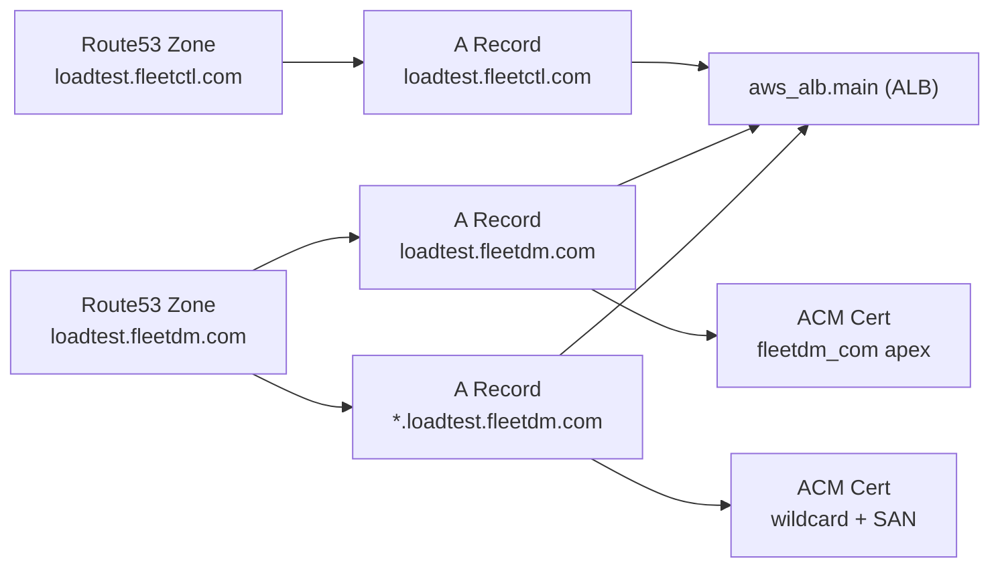

<!-- source-hash: a704a25194483e666004ceefde711453 -->
Terraform configuration that provisions AWS Route 53 hosted zones, DNS records, and ACM TLS certificates for the FleetDM load testing domains (`loadtest.fleetctl.com` and `loadtest.fleetdm.com`).

## Key Components

| Resource | Name | Purpose |
|---|---|---|
| `aws_route53_zone` | `fleetctl_com`, `fleetdm_com` | Hosted zones for both load test domains |
| `aws_route53_record` | `fleetctl_com`, `fleetdm_com` | Apex `A` alias records pointing to the main ALB |
| `aws_route53_record` | `wildcard` | Wildcard `A` alias (`*.loadtest.fleetdm.com`) pointing to the main ALB |
| `aws_acm_certificate` | `wildcard` | TLS cert covering the wildcard domain with `loadtest.fleetdm.com` as a SAN |
| `aws_acm_certificate` | `fleetdm_com` | Dedicated TLS cert for the apex `loadtest.fleetdm.com` domain |
| `aws_route53_record` | `wildcard_validation`, `fleetdm_com_validation` | DNS CNAME records for ACM DNS validation |
| `aws_acm_certificate_validation` | `wildcard`, `fleetdm_com` | Waits for ACM to confirm certificate issuance |

## Architecture



## Usage Example

This file is applied as part of the broader load test Terraform stack. No standalone invocation is needed, but you can target these resources directly:

```bash
# Plan only Route 53 / ACM resources
terraform plan -target=aws_route53_zone.fleetdm_com \
               -target=aws_acm_certificate.wildcard

# Apply certificate validation only
terraform apply -target=aws_acm_certificate_validation.wildcard \
                -target=aws_acm_certificate_validation.fleetdm_com
```

> Both ACM certificates use `create_before_destroy` to prevent downtime during certificate rotation.

**Source:** [`r53.tf`](https://github.com/flamingo-stack/fleetmdm/blob/main/r53.tf)