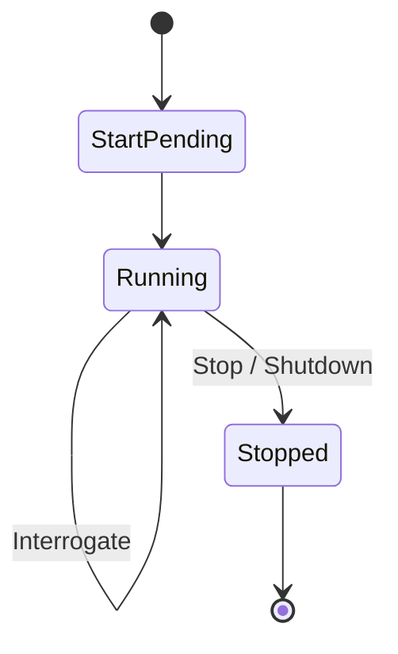

<!-- source-hash: 6167da4a5ccb7b72c1bf701fea65c80d -->
Windows Service Control Manager (SCM) integration for managing Fleet agent lifecycle as a Windows service, handling start, stop, shutdown, and interrogate commands.

## Key Components

| Symbol | Type | Description |
|---|---|---|
| `windowsService` | struct | Implements `svc.Handler`; holds channels for coordinating interrupt and shutdown signals |
| `Execute` | method | SCM command loop handling `Stop`, `Shutdown`, and `Interrogate` requests |
| `SetupServiceManagement` | func | Entry point that detects Windows service context and registers the handler with the SCM |

## Usage Example

```go
interruptCh := make(chan struct{})
doneCh := make(chan struct{})

// Start your application runners in a goroutine,
// closing doneCh when they exit.
go func() {
    runApp(interruptCh)
    close(doneCh)
}()

// Registers with SCM if running as a Windows service;
// no-op when running interactively.
osservice.SetupServiceManagement("FleetAgent", interruptCh, doneCh)
```

## SCM Lifecycle



## Notes

- `SetupServiceManagement` is a no-op when the process is not running under the SCM (detected via `svc.IsWindowsService()`).
- On `Stop`/`Shutdown`, the handler closes `interruptCh` to signal runners, waits on `appDoneCh` for a clean drain, then calls `os.Exit(windows.NO_ERROR)` for a hard exit.
- Built only on Windows via the `//go:build windows` constraint.

**Source:** [`osservice_windows.go`](https://github.com/flamingo-stack/fleetmdm/blob/main/osservice_windows.go)