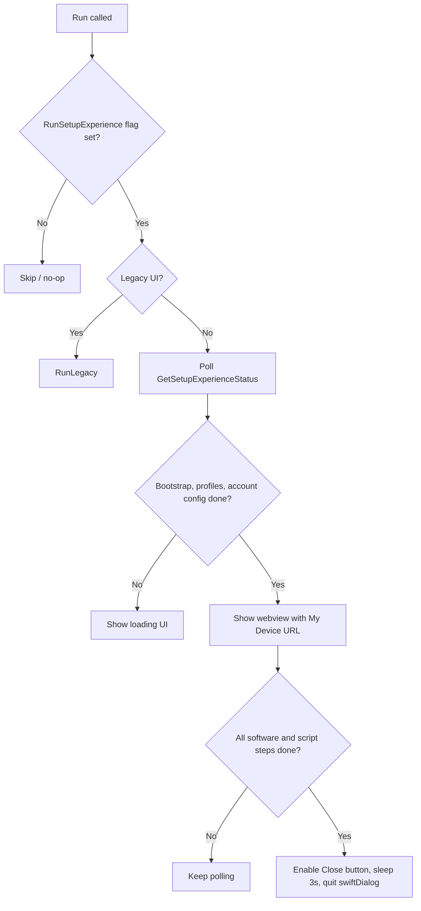

<!-- source-hash: 366fe398bbc738fac22820cce84a6910 -->
Manages the macOS Setup Assistant setup experience flow, orchestrating swiftDialog UI to display software installation and script execution status before users gain full device access.

## Key Components

| Export | Type | Description |
|---|---|---|
| `OrbitClient` | Interface | Minimal interface for Fleet server communication; fetches setup experience status |
| `DeviceClient` | Interface | Minimal interface to retrieve the device's browser URL |
| `SetupExperiencer` | Struct | Singleton that manages the full setup experience lifecycle |
| `NewSetupExperiencer` | Constructor | Initializes a `SetupExperiencer` with orbit/device clients, root dir, and token reader/writer |
| `Run` | Method | Main polling loop; checks status, starts swiftDialog, transitions between loading and webview UI |
| `anyProfilePending` | Helper | Scans configuration profiles for any in `MDMDeliveryPending` state |
| `startSwiftDialog` | Method | Creates and launches the swiftDialog instance with appropriate initial options |

## Usage Example

```go
trw := token.NewReadWriter(tokenFilePath)
orbitClient := myOrbitClient{}
deviceClient := myDeviceClient{}

se := setupexperience.NewSetupExperiencer(
    orbitClient,
    deviceClient,
    "/opt/orbit",
    trw,
)

// Called periodically by Orbit's main loop with the current OrbitConfig
if err := se.Run(orbitConfig); err != nil {
    log.Error().Err(err).Msg("setup experience run failed")
}
```

## Flow Summary



## Notes

- `SetupExperiencer` is **not concurrency-safe**; designed as a singleton called within a single goroutine/WaitGroup.
- Token rotation is started lazily on first `Run` invocation and stopped when setup completes.
- `UseLegacyUI` flag is set externally (by the main Orbit function) based on server capabilities.
- See [`setup_experience.go`](https://github.com/flamingo-stack/fleetmdm/blob/main/orbit/pkg/setup_experience/setup_experience.go) for the full implementation.