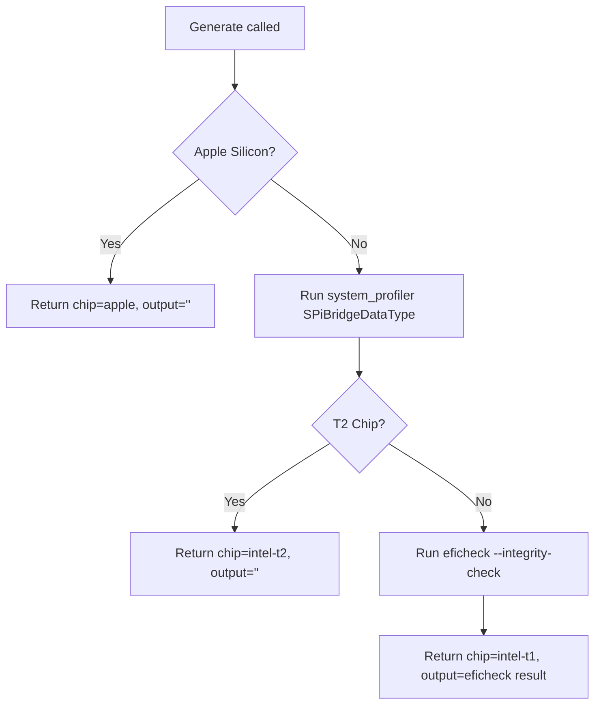

<!-- source-hash: 7f8dc507a1b291b69b3e48066758b918 -->
Implements a macOS-only osquery table plugin that performs a Legacy EFI firmware integrity check, fulfilling the macOS 13 CIS benchmark control 5.9 "Ensure Legacy EFI Is Valid and Updating."

## Key Components

| Export | Type | Description |
|--------|------|-------------|
| `Columns()` | `func` | Defines the table schema with two columns: `chip` (string) and `output` (string) |
| `Generate()` | `func` | Query-time handler that detects chip type and runs the appropriate EFI integrity check |

## Logic Flow



## Chip Detection Strategy

| Chip Type | Detection Method | EFI Check Performed |
|-----------|-----------------|---------------------|
| Apple Silicon | `unix.Sysctl("machdep.cpu.brand_string")` contains `"Apple"` | None (not applicable) |
| Intel T2 | `system_profiler SPiBridgeDataType` contains `"Apple T2 Security Chip"` | None (T2 handles EFI security) |
| Intel T1/Legacy | All other Intel Macs | `/usr/libexec/firmwarecheckers/eficheck/eficheck --integrity-check` |

## Usage Example

Register the table with an osquery-go plugin server:

```go
plugin := table.NewPlugin(
    "firmware_eficheck_integrity_check",
    firmware_eficheck_integrity_check.Columns(),
    firmware_eficheck_integrity_check.Generate,
)
server.RegisterPlugin(plugin)
```

Query from osquery:

```sql
SELECT chip, output
FROM firmware_eficheck_integrity_check;
```

**Source:** [`firmware_eficheck_integrity_check_darwin.go`](https://github.com/flamingo-stack/fleetmdm/blob/main/firmware_eficheck_integrity_check_darwin.go)