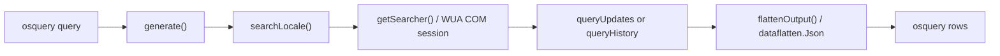

<!-- source-hash: 72c5151637b82930f4f4ed61ee2a9e45 -->
Windows-only osquery table plugin that exposes Windows Update data (available updates and update history) through two virtual tables: `windows_updates` and `windows_update_history`.

## Key Components

| Symbol | Type | Description |
|--------|------|-------------|
| `tableMode` | `int` (enum) | Selects between `UpdatesTable` and `HistoryTable` modes |
| `windowsUpdatesSearcher` | interface | Abstracts WUA search (`Search`) and history (`QueryHistoryAll`) calls |
| `Table` | struct | Core plugin struct holding the logger, query function, and table name |
| `TablePlugin` | func | Constructs and registers the osquery plugin for a given mode |
| `queryUpdates` | func | Searches for uninstalled software updates via WUA |
| `queryHistory` | func | Retrieves the full Windows Update installation history |
| `generate` | method | osquery entry point; iterates over locale constraints and aggregates rows |
| `searchLocale` | method | Initialises a COM-aware WUA session for a specific locale and flattens results |
| `flattenOutput` | method | JSON-marshals WUA results then runs `dataflatten.Json` for query filtering |
| `getSearcher` | func | Creates a `windowsupdate.IUpdateSearcher` with optional locale override |

## Usage Example

```go
import (
    windowsupdatetable "github.com/flamingo-stack/fleetmdm/orbit/pkg/table/windowsupdatetable"
    "github.com/rs/zerolog"
)

logger := zerolog.New(os.Stdout)

// Register the available-updates table
updatesPlugin := windowsupdatetable.TablePlugin(windowsupdatetable.UpdatesTable, logger)

// Register the update-history table
historyPlugin := windowsupdatetable.TablePlugin(windowsupdatetable.HistoryTable, logger)

// Pass both plugins to the osquery extension manager
client.RegisterPlugin(updatesPlugin, historyPlugin)
```

> **Note:** Both tables accept an optional `locale` column constraint (e.g. `WHERE locale = '1033'`). The default value `_default` uses the system locale. COM is managed via `comshim` — one reference is acquired per locale query and released with `defer`.

## Architecture Notes

